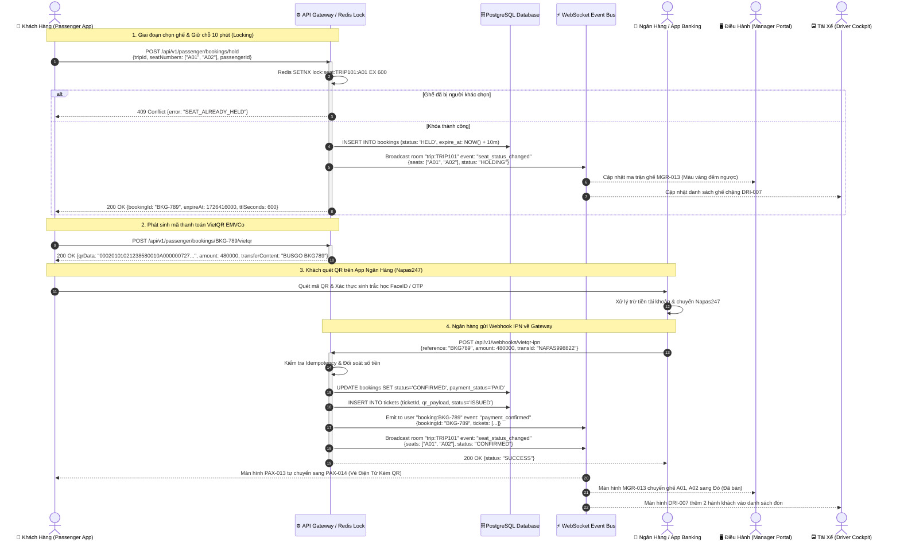

# FLOW-01: Đặt Vé, Giữ Chỗ & Thanh Toán VietQR Tức Thì (Instant Booking & Settlement)

**Mã tài liệu:** `FLOW-01`  
**Phiên bản:** 1.0  
**Liên kết màn hình:** [PAX-009](file:///home/david/Downloads/scripts/AI_tools/tools/FleetBus/screen-spec/passenger/PAX-009-seat-selection.md), [PAX-010](file:///home/david/Downloads/scripts/AI_tools/tools/FleetBus/screen-spec/passenger/PAX-010-seat-hold-timer.md), [PAX-012](file:///home/david/Downloads/scripts/AI_tools/tools/FleetBus/screen-spec/passenger/PAX-012-payment-methods.md), [PAX-013](file:///home/david/Downloads/scripts/AI_tools/tools/FleetBus/screen-spec/passenger/PAX-013-vietqr-transfer.md), [PAX-014](file:///home/david/Downloads/scripts/AI_tools/tools/FleetBus/screen-spec/passenger/PAX-014-payment-success.md), [MGR-013](file:///home/david/Downloads/scripts/AI_tools/tools/FleetBus/screen-spec/manager/MGR-013-seat-inventory-matrix.md), [MGR-017](file:///home/david/Downloads/scripts/AI_tools/tools/FleetBus/screen-spec/manager/MGR-017-booking-management.md)

---

## 1. Mục Tiêu & Mô Tả Nghiệp Vụ

Luồng cho phép hành khách chọn ghế trên sơ đồ xe 2 tầng, hệ thống khóa giữ chỗ bằng Redis Distributed Lock trong thời gian đếm ngược 10 phút, tạo mã VietQR động chuẩn EMVCo kèm mã tham chiếu độc nhất (`REF-{bookingId}`). Khi người dùng chuyển khoản qua ứng dụng Mobile Banking, cổng thanh toán bắn Webhook IPN về Backend, hệ thống kích hoạt xác nhận thanh toán tức thì (< 1.5s), tự động xuất vé điện tử và đồng bộ sơ đồ ghế thời gian thực sang Manager Operations Portal và Driver Tactical Cockpit.

---

## 2. Sơ Đồ Trình Tự Tương Tác (Mermaid Sequence Diagram)

---

## 3. Các Điểm Kiểm Soát & Xử Lý Ngoại Lệ (Exception & Failure Handling)

| Tình huống ngoại lệ | Cơ chế xử lý kỹ thuật | Trạng thái hiển thị giao diện |
| :--- | :--- | :--- |
| **Hết hạn 10 phút chưa thanh toán** | Redis TTL Key Expired → Scheduler bắn worker xóa booking `HELD` → Giải phóng ghế. | PAX-010 hiển thị popup hết giờ, MGR-013 trả ghế về màu Xanh (Trống). |
| **Khách chuyển thiếu tiền** | Webhook ghi nhận `PARTIALLY_PAID`, gửi tin nhắn SMS cảnh báo bổ sung kèm link thanh toán. | PAX-013 hiển thị cảnh báo: "Đã nhận 400.000đ / 480.000đ. Vui lòng chuyển thêm 80.000đ". |
| **Khách chuyển thừa tiền** | Webhook ghi nhận `OVERPAID`, hệ thống xác nhận vé và ghi có số tiền thừa vào số dư ví hoàn tự động. | MGR-017 cảnh báo gắn tag `CẦN_HOÀN_TIỀN_THỪA`. |
| **Webhook trễ / Mất mạng ngân hàng** | Khách nhấn "Tôi đã chuyển tiền" trên PAX-013 → Gọi `GET /api/v1/passenger/bookings/:id/verify-payment` để cưỡng bức truy vấn API ngân hàng. | Spinner quay kiểm tra trực tiếp trạng thái lệnh Napas. |
