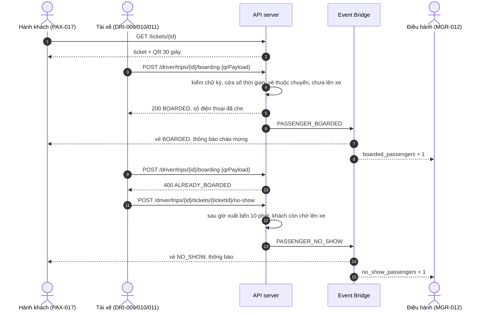

# FLOW-02: Xuất vé QR, soát vé và vắng mặt

**Mã tài liệu:** `FLOW-02`
**Phiên bản:** 2.0 (Giai đoạn C)
**Màn hình:** [PAX-016](../passenger/PAX-016-my-tickets.md), [PAX-017](../passenger/PAX-017-ticket-detail-qr.md), [DRI-007](../driver/DRI-007-manifest.md), [DRI-009](../driver/DRI-009-scan-qr.md), [DRI-010](../driver/DRI-010-manual-boarding.md), [DRI-011](../driver/DRI-011-mark-no-show.md), [DRI-015](../driver/DRI-015-offline-sync-center.md), [MGR-012](../manager/MGR-012-trip-detail.md)

---

## 1. Mục tiêu

Soát vé nhanh, chống gian lận, và mọi bên thấy cùng một trạng thái: khách thấy vé "đã lên xe", điều hành thấy số khách lên xe và vắng mặt. Mọi cách lên xe (QR động, QR đoàn, PIN, vé ngoại tuyến, lên xe thủ công) đi qua cùng một bước đánh dấu `BOARDED` (`DRI-009`, `FND-A37`).

## 2. Các bước và API thật

| # | Bước | Màn hình | API | Bên khác thấy gì | Test |
| :-- | :--- | :--- | :--- | :--- | :--- |
| 1 | Khách mở vé: QR đổi mỗi 30 giây, ký HMAC-SHA256 | PAX-017 | `GET /api/v1/tickets/{ticketId}` | | `TC-SPEC-A24` |
| 2 | Tài xế quét QR (một vé, vé đoàn hoặc vé ký sẵn ngoại tuyến) | DRI-009 | `POST /api/v1/driver/trips/{tripId}/boarding` `{qrPayload}` | Vé `BOARDED`; điều hành thấy `boarded_passengers` tăng; khách nhận `BOARDING_REMINDER` | `TC-SYNC-02`, `TC-FLOW-C04` |
| 3 | Quét lại cùng vé | DRI-009 | cùng API | `400 ALREADY_BOARDED`, thẻ đỏ "VÉ ĐÃ LÊN XE TRƯỚC ĐÓ" | `TC-FLOW-C04` |
| 4 | QR giả hoặc sai chữ ký | DRI-009 | cùng API | `400 INVALID_SIGNATURE` | `TC-SPEC-A24` |
| 5 | Điện thoại khách hỏng: nhập PIN 6 số hoặc chọn tay | DRI-010 | `POST .../boarding/manual` `{ticket_id, pin}` hoặc `{ticket_id}` | như bước 2 | `TC-SPEC-A37` |
| 6 | Khách xem lại vé sau khi lên xe | PAX-016, PAX-017 | `GET /passenger/tickets?tab=UPCOMING`, `GET /tickets/{id}` | Vé nằm ở **Sắp đi** với trạng thái `BOARDED` đến hết chuyến, mở được, không còn QR; sau khi tài xế kết thúc chuyến chuyển sang **Lịch sử** | `TC-FLOW-C04` |
| 7 | Quá 10 phút sau giờ xuất bến, khách chưa đến: đánh dấu vắng mặt | DRI-011 | `POST .../tickets/{ticketId}/no-show` | Vé `NO_SHOW` (tab Lịch sử), điều hành thấy `no_show_passengers` tăng, khách nhận `NO_SHOW`, ghế trống lại từ điểm xe đã tới | `TC-FLOW-C05`, `TC-SPEC-A43` |

## 3. Sơ đồ

## 4. Quy tắc

1. **Chống phát lại:** vé đã lên xe bị từ chối ở mọi đường lên xe (`ALREADY_BOARDED`). Bản cũ của flow ghi `409 TICKET_ALREADY_USED`; mã thật là `400 ALREADY_BOARDED` (`DRI-009`).
2. **Dung sai đồng hồ:** server và tablet chấp nhận lệch ±2 bước 30 giây (cửa sổ 90 giây) (`BR-TICKET-006`).
3. **PIN:** sinh từ bí mật của vé, đưa cho người được ủy quyền khi khách chia sẻ vé (`POST /passenger/tickets/{id}/delegate`).
4. **Không có hạn chế riêng cho số điện thoại:** tài xế chỉ thấy số đã che (`OQ-007`).
5. **Vắng mặt:** không hoàn tiền; ghế được nhả từ điểm dừng xe đã tới đến hết đoạn của khách, nên bán lại hoặc đón khách vẫy được cho phần đường còn lại; phần đã đi vẫn tính là đã bán (`OQ-028`, `TC-SEG-06`).

## 5. Chưa làm

- Danh sách vé và PIN tải sẵn về SQLite ở thiết bị, hàng đợi gửi lên khi có mạng: là việc của app Flutter (`OQ-029`); server nhận lại qua `POST /driver/telemetry/batch-replay` (`DRI-015`) với telemetry.
- Đẩy sự kiện thời gian thực cho khách: PAX-016 và PAX-017 phải hỏi lại.
