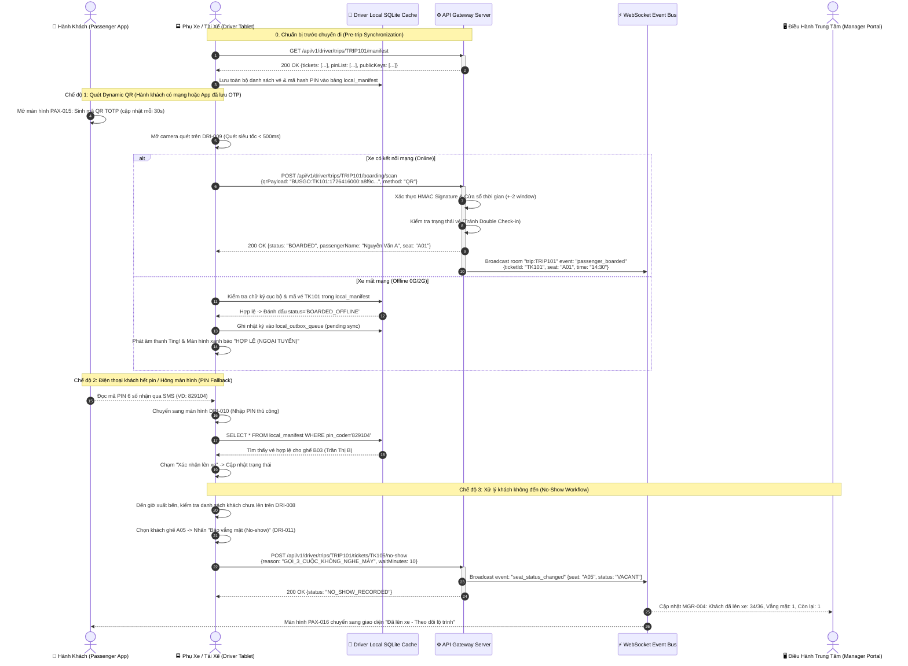

# FLOW-02: Xuất Vé QR & Soát Vé Đa Phương Thức (Multimodal Boarding & Verification)

**Mã tài liệu:** `FLOW-02`  
**Phiên bản:** 1.0  
**Liên kết màn hình:** [PAX-015](file:///home/david/Downloads/scripts/AI_tools/tools/FleetBus/screen-spec/passenger/PAX-015-ticket-detail-qr.md), [PAX-016](file:///home/david/Downloads/scripts/AI_tools/tools/FleetBus/screen-spec/passenger/PAX-016-trip-companion-hud.md), [DRI-008](file:///home/david/Downloads/scripts/AI_tools/tools/FleetBus/screen-spec/driver/DRI-008-boarding-manifest.md), [DRI-009](file:///home/david/Downloads/scripts/AI_tools/tools/FleetBus/screen-spec/driver/DRI-009-qr-scanner-hud.md), [DRI-010](file:///home/david/Downloads/scripts/AI_tools/tools/FleetBus/screen-spec/driver/DRI-010-manual-boarding-entry.md), [DRI-011](file:///home/david/Downloads/scripts/AI_tools/tools/FleetBus/screen-spec/driver/DRI-011-no-show-confirmation.md), [MGR-004](file:///home/david/Downloads/scripts/AI_tools/tools/FleetBus/screen-spec/manager/MGR-004-realtime-trip-detail.md)

---

## 1. Mục Tiêu & Mô Tả Nghiệp Vụ

Quy trình soát vé tại cửa xe là mắt xích quan trọng nhằm tối đa hóa tốc độ lên xe (< 2 giây/hành khách), ngăn chặn gian lận vé (chụp màn hình gửi cho người khác đi nhờ), đồng thời hỗ trợ vận hành liên tục ngay cả khi xe ở trong tầng hầm bến xe hoặc khu vực mất sóng di động hoàn toàn (0G/2G).

Hệ thống cung cấp 4 chế độ xác thực linh hoạt:
1. **Dynamic TOTP QR**: Mã QR tự làm mới mỗi 30 giây bằng chữ ký HMAC-SHA256, Gateway và Tablet chấp nhận sai số dung sai `+-2` bước thời gian (cửa sổ 90 giây) để khắc phục lệch đồng hồ thiết bị.
2. **Group QR (Vé nhóm)**: Một mã QR đại diện duy nhất cho nhóm 2–5 hành khách, tài xế quét 1 lần và chọn xác nhận toàn bộ hoặc từng người có mặt.
3. **Mã PIN 6 số ngoại tuyến (Offline PIN)**: Khi điện thoại khách hết pin hoặc màn hình nứt vỡ không quét được QR, tài xế nhập mã PIN in trên SMS/Zalo; tablet đối soát trực tiếp trong cơ sở dữ liệu SQLite cục bộ.
4. **Offline Sync**: Tất cả giao dịch soát vé offline được lưu vào hàng đợi SQLite Outbox và tự động đẩy lên máy chủ ngay khi có lại kết nối 4G/Wi-Fi.

---

## 2. Sơ Đồ Trình Tự Tương Tác (Mermaid Sequence Diagram)

---

## 3. Quy Định An Ninh & Chống Gian Lận (Security Rules)

1. **Anti-Replay Attack**: Mã QR chứa `nonce` và `timestamp`. Một mã QR đã quét thành công trên bất kỳ thiết bị nào sẽ bị từ chối ngay lập tức nếu cố quét lại lần thứ hai (`409 TICKET_ALREADY_USED`).
2. **Mã PIN OTP Salted**: Mã PIN 6 số được sinh tự động bằng hàm mật mã ngẫu nhiên kèm salt bí mật của chuyến xe, chỉ có hiệu lực duy nhất trong ngày khởi hành của chuyến đi đó.
3. **Dung sai thời gian (Time Drift Margin)**: Để tránh trường hợp đồng hồ trên điện thoại hành khách bị chạy chậm hoặc nhanh hơn đồng hồ chuẩn NTP của server, thuật toán TOTP cho phép sai lệch tối đa $\pm 2$ chu kỳ (tổng biên độ $90\text{s}$).
