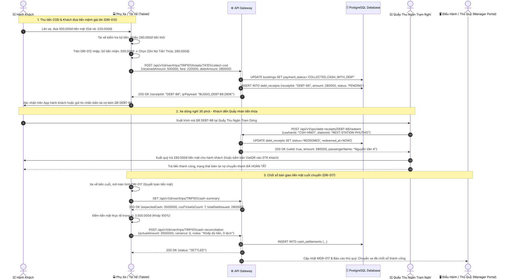
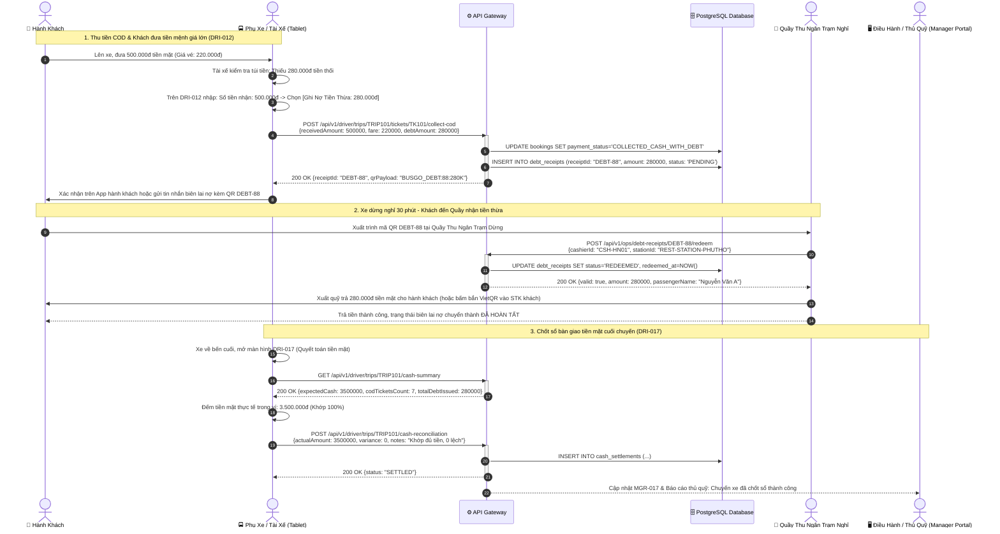

# FLOW-03: Thu Tiền COD & Biên Lai Nợ Tiền Thừa Tại Trạm Dừng (COD Collection & Debt Settlement)

**Mã tài liệu:** `FLOW-03`  
**Phiên bản:** 1.0  
**Liên kết màn hình:** [DRI-012](file:///home/david/Downloads/scripts/AI_tools/tools/FleetBus/screen-spec/driver/DRI-012-fare-collection-cod.md), [DRI-017](file:///home/david/Downloads/scripts/AI_tools/tools/FleetBus/screen-spec/driver/DRI-017-cash-reconciliation-shift-end.md), [PAX-012](file:///home/david/Downloads/scripts/AI_tools/tools/FleetBus/screen-spec/passenger/PAX-012-payment-methods.md), [PAX-015](file:///home/david/Downloads/scripts/AI_tools/tools/FleetBus/screen-spec/passenger/PAX-015-ticket-detail-qr.md), [MGR-017](file:///home/david/Downloads/scripts/AI_tools/tools/FleetBus/screen-spec/manager/MGR-017-booking-management.md), [MGR-028](file:///home/david/Downloads/scripts/AI_tools/tools/FleetBus/screen-spec/manager/MGR-028-audit-logs.md)

---

## 1. Mục Tiêu & Mô Tả Nghiệp Vụ

Trong vận tải liên tỉnh tại Việt Nam, một tỷ lệ lớn hành khách vẫn chọn hình thức thanh toán tiền mặt khi lên xe (COD - Cash on Delivery) hoặc đón xe dọc đường. 
Thực tế nảy sinh hai vấn đề nan giải:
1. **Tài xế / phụ xe không có đủ tiền lẻ trả lại**: Ví dụ vé 220.000đ, khách đưa tờ 500.000đ nhưng đầu ca tài xế chưa có đủ 280.000đ tiền lẻ.
2. **Nguy cơ thất thoát tiền mặt**: Thu tiền mặt dễ dẫn đến gian lận nếu không có sự đối soát khép kín giữa số tiền thực thu, tiền nợ và tiền nộp về thủ quỹ.

Hệ thống giải quyết triệt để vấn đề này qua tính năng **Biên Lai Nợ Tiền Thừa (Debt Receipt / Change Voucher)**:
- Tài xế ghi nhận số tiền khách đưa và số tiền còn nợ trên màn hình `DRI-012`.
- Hệ thống phát sinh một mã QR Biên lai nợ tiền thừa đẩy thẳng vào ứng dụng của hành khách (hoặc in/gửi SMS).
- Khi xe ghé trạm dừng chân hoặc bến cuối, khách mang mã này đến quầy thủ quỹ trạm dừng để nhận lại tiền mặt, hoặc chọn nhận chuyển khoản qua VietQR.
- Cuối ca chạy, tài xế thực hiện chốt sổ tiền mặt trên `DRI-017`, đối chiếu số tiền thực tế với số tiền hệ thống tính toán trước khi bàn giao cho quản lý.

---

## 2. Sơ Đồ Trình Tự Tương Tác (Mermaid Sequence Diagram)

> [!TIP]
> **Tùy chọn tải & xem bản vẽ UML:** [Xem ảnh Vector SVG](./images/FLOW-03-cod-cash-debt-settlement.svg) | [Xem ảnh PNG HD](./images/FLOW-03-cod-cash-debt-settlement.png)

---

## 3. Quy Định Kiểm Soát & Đối Soát Tài Chính

1. **Khóa liên động trạng thái (State Interlocking)**: Một chuyến xe chỉ có thể đóng trạng thái `COMPLETED` khi toàn bộ các khoản COD đều đã được chốt (hoặc thu đủ tiền, hoặc ghi nhận biên lai nợ đã nạp vào hệ thống).
2. **Giới hạn nợ tiền thừa tối đa**: Mỗi tài xế không được phát hành tổng biên lai nợ vượt quá $1.000.000\text{đ}$ trên một chuyến đi để giảm thiểu rủi ro gian lận.
3. **Audit Log Bất biến**: Bất kỳ hành động phát hành biên lai nợ hay hoàn trả tiền thừa tại trạm dừng đều được ghi vào bảng `audit_logs` có đính kèm tọa độ GPS và định danh nhân viên thực hiện.
