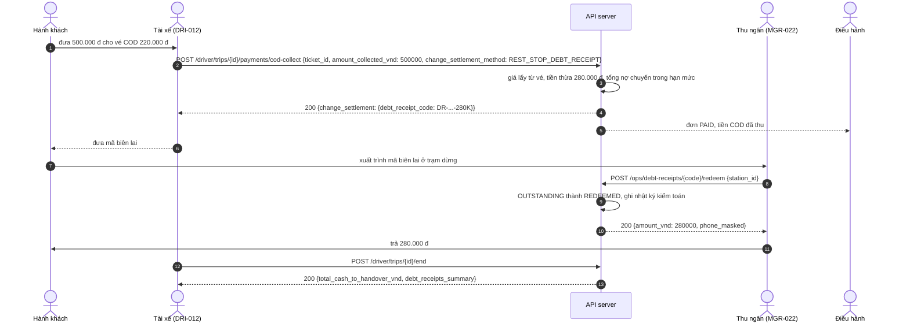

# FLOW-03: Thu tiền COD, biên lai nợ tiền thừa và chốt chuyến

**Mã tài liệu:** `FLOW-03`
**Phiên bản:** 2.0 (Giai đoạn C)
**Màn hình:** [DRI-012](../driver/DRI-012-cod-collection.md), [DRI-017](../driver/DRI-017-end-trip.md), [MGR-018](../manager/MGR-018-booking-detail.md), [MGR-022](../manager/MGR-022-refund-center.md), [MGR-028](../manager/MGR-028-audit-logs.md)

---

## 1. Mục tiêu

Tài xế thu tiền mặt của vé COD. Khi khách đưa tiền lớn và tài xế thiếu tiền lẻ, tài xế có thể phát biên lai nợ tiền thừa để khách nhận lại ở trạm dừng hoặc bến. Cuối chuyến, báo cáo kết thúc liệt kê số tiền phải nộp và các biên lai nợ.

## 2. Các bước và API thật

| # | Bước | Màn hình | API | Kết quả | Test |
| :-- | :--- | :--- | :--- | :--- | :--- |
| 1 | Thu COD: giá lấy từ vé trong manifest, khách phải đưa đủ giá | DRI-012 | `POST /api/v1/driver/trips/{tripId}/payments/cod-collect` `{ticket_id, amount_collected_vnd, change_settlement_method}` | Vé `BOARDED`, thanh toán `SUCCESS`; điều hành thấy đơn `PAID` và tiền COD đã thu | `TC-SPEC-A39` |
| 2 | Tiền thừa: `CASH_RETURNED` (trả ngay), `WALLET_CREDIT` (cộng ví khách) hoặc `REST_STOP_DEBT_RECEIPT` (biên lai nợ `DR-<vé>-<nghìn>K`) | DRI-012 | cùng API | Biên lai ở trạng thái `OUTSTANDING`, khách nhận mã | `TC-SPEC-A39`, `TC-FLOW-C06` |
| 3 | Tổng biên lai nợ của một chuyến không quá 1.000.000 đ | DRI-012 | cùng API | Vượt: `400 DEBT_LIMIT_EXCEEDED`, vé chưa thu, tài xế trả tiền thừa bằng tiền mặt hoặc ví (`BR-COD-005`) | `TC-FLOW-C06` |
| 4 | Khách xuất trình mã biên lai ở quầy trạm dừng, thu ngân trả tiền | MGR-022 | `POST /api/v1/ops/debt-receipts/{receiptCode}/redeem` `{station_id}` | Biên lai `REDEEMED`, ghi nhật ký `DEBT_REDEEMED`; trả lại lần hai: `409 DEBT_ALREADY_REDEEMED` | `TC-FLOW-C07` |
| 5 | Xe về bến cuối, tài xế kết thúc chuyến | DRI-017 | `POST /api/v1/driver/trips/{tripId}/end` | Server tự tính tiền mặt phải nộp từ manifest, liệt kê mã biên lai; chuyến `COMPLETED` một lần | `TC-SPEC-A41c` |

## 3. Sơ đồ

## 4. Quy tắc

1. Giá COD là giá trên vé, client không đổi được; vé COD chỉ thu một lần; thiếu tiền là `400 INSUFFICIENT_AMOUNT` (`BR-COD-003`, `OQ-024`).
2. Hạn mức nợ tiền thừa 1.000.000 đ mỗi chuyến tính trên mọi biên lai đã phát, kể cả đã trả (`BR-COD-005`).
3. Thu ngân phải là `CASHIER`, `FLEET_DIRECTOR` hoặc `FINANCIAL_CONTROLLER`; tài xế và điều phối viên không có quyền (`BR-REFUND-003`).
4. Mọi thao tác trả nợ vào nhật ký kiểm toán (`MGR-028`) kèm người thực hiện.

## 5. Khác với bản cũ

- Bản cũ có `GET .../cash-summary` và `POST .../cash-reconciliation`; không màn hình nào dùng. Server tính tiền phải nộp ngay trong `POST .../end` (`BR-END-004`): **bỏ** hai endpoint này.
- Bản cũ ghi "chuyến chỉ đóng khi mọi COD đã chốt" và "ghi tọa độ GPS trong nhật ký": chưa làm. Báo cáo kết thúc chỉ đếm `unresolved_passenger_count`.
- Chưa có màn hình thu ngân riêng: thao tác `redeem` gắn vào Trung tâm hoàn tiền `MGR-022` cho đến khi có màn hình.
