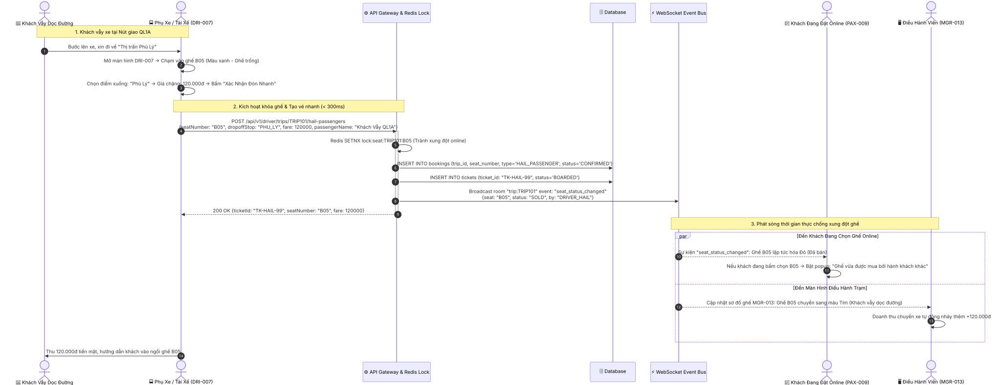
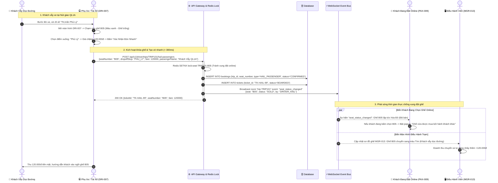

# FLOW-04: Đón Khách Vẫy Dọc Đường & Khóa Ghế Thời Gian Thực (Onboard Hail Passengers)

**Mã tài liệu:** `FLOW-04`  
**Phiên bản:** 1.0  
**Liên kết màn hình:** [DRI-006](file:///home/david/Downloads/scripts/AI_tools/tools/FleetBus/screen-spec/driver/DRI-006-driving-hud-route.md), [DRI-007](file:///home/david/Downloads/scripts/AI_tools/tools/FleetBus/screen-spec/driver/DRI-007-passenger-manifest-route.md), [PAX-009](file:///home/david/Downloads/scripts/AI_tools/tools/FleetBus/screen-spec/passenger/PAX-009-seat-selection.md), [MGR-013](file:///home/david/Downloads/scripts/AI_tools/tools/FleetBus/screen-spec/manager/MGR-013-seat-inventory-matrix.md), [MGR-017](file:///home/david/Downloads/scripts/AI_tools/tools/FleetBus/screen-spec/manager/MGR-017-booking-management.md)

---

## 1. Mục Tiêu & Mô Tả Nghiệp Vụ

Trong hành trình xe khách chạy liên tỉnh, tài xế thường xuyên bắt gặp khách vẫy dọc quốc lộ hoặc các nút giao đường gom cao tốc. 
Thách thức lớn nhất là:
1. **Xung đột ghế (Seat Collision)**: Nếu khách vẫy bước lên xe ngồi vào ghế B05, nhưng cùng lúc đó một hành khách ở chặng kế tiếp đang mở ứng dụng Passenger App để đặt online ghế B05. Nếu không khóa tức thì, sẽ xảy ra tình huống "1 ghế bán 2 người".
2. **Thao tác lái xe nhanh (< 5 giây)**: Tài xế hoặc phụ xe chỉ có vài giây để chọn ghế trống, xác nhận chặng xuống và thu tiền mà không làm gián đoạn hành trình.

Giải pháp:
- Phụ xe mở sơ đồ ghế trực quan trên `DRI-007`. Các ghế trống được tô màu xanh lá cây kèm số tiền chặng tương ứng.
- Chạm vào ghế trống -> Nhấn "Đón khách vẫy" -> Hệ thống lập tức bắn Distributed Lock lên Redis và phát sóng WebSocket tới toàn bộ máy khách đang xem sơ đồ ghế chuyến đó.
- Ghế lập tức đổi sang màu Đỏ (Đã bán) trên App của hành khách trực tuyến và bảng điều hành Manager.

---

## 2. Sơ Đồ Trình Tự Tương Tác (Mermaid Sequence Diagram)

> [!TIP]
> **Tùy chọn tải & xem bản vẽ UML:** [Xem ảnh Vector SVG](./images/FLOW-04-onboard-hail-passengers.svg) | [Xem ảnh PNG HD](./images/FLOW-04-onboard-hail-passengers.png)

---

## 3. Các Ràng Buộc & Tiêu Chí An Toàn

1. **Khóa phân tán nguyên tử (Atomic Redis Lock)**: Thao tác giữ ghế của tài xế sử dụng chung cơ chế Redis Lock với hành khách đặt online, bảo đảm không bao giờ xảy ra Race Condition.
2. **Khách vẫy không có số điện thoại**: Hệ thống tự sinh mã tham chiếu đại diện `HAIL-{HHmm}-{Seat}` để phụ xe không phải mất thời gian nhập liệu khi xe đang di chuyển.
3. **Phân biệt nguồn vé trên Báo cáo**: Doanh thu từ khách vẫy được gắn nhãn riêng `SOURCE: ONBOARD_HAIL` để quản lý kiểm tra đối chiếu tỷ lệ lấp đầy ghế và tính minh bạch của tổ lái xe.
