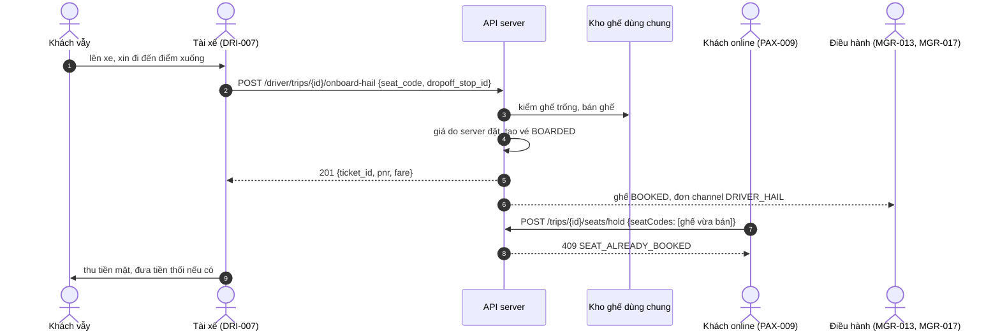

# FLOW-04: Đón khách vẫy dọc đường

**Mã tài liệu:** `FLOW-04`
**Phiên bản:** 2.0 (Giai đoạn C)
**Màn hình:** [DRI-007](../driver/DRI-007-manifest.md), [PAX-009](../passenger/PAX-009-seat-map.md), [MGR-013](../manager/MGR-013-trip-seat-inventory.md), [MGR-017](../manager/MGR-017-booking-search.md)

---

## 1. Mục tiêu

Khách vẫy xe giữa đường. Tài xế chọn một ghế trống, điểm xuống, nhận tiền mặt; ghế bán ngay cho mọi kênh và doanh thu vào báo cáo của quản lý.

## 2. Các bước và API thật

| # | Bước | Màn hình | API | Bên khác thấy gì | Test |
| :-- | :--- | :--- | :--- | :--- | :--- |
| 1 | Chuyến phải đang chạy (`IN_TRANSIT`), ghế phải trống ở kho ghế chung | DRI-007 | `POST /api/v1/driver/trips/{tripId}/onboard-hail` `{seat_code, dropoff_stop_id, passenger_name?, amount_collected_vnd?}` | Giá chặng do server đặt, giá client gửi bị bỏ (`OQ-024`) | `TC-SPEC-A40` |
| 2 | Vé phát hành, trạng thái `BOARDED`, mã `BG-HAIL-xxx` | DRI-007 | cùng API, `201` | Ghế `BOOKED` kèm PNR ở ma trận ghế của điều hành | `TC-FLOW-C08` |
| 3 | Khách online đang chọn đúng ghế đó | PAX-009 | `POST /trips/{id}/seats/hold` | `409 SEAT_ALREADY_BOOKED`; quầy bán vé cũng bị `409` | `TC-FLOW-C08` |
| 4 | Điều hành xem đơn | MGR-017 | `GET /api/v1/ops/bookings` | Đơn có `channel: DRIVER_HAIL` và doanh thu của ghế | `TC-FLOW-C08` |
| 5 | Ghế đã có người | DRI-007 | cùng API | `409 SEAT_OCCUPIED` | `TC-SPEC-A40` |

## 3. Sơ đồ

## 4. Quy tắc

0. **Khách vẫy đi một đoạn:** từ điểm xe đã tới (`DRI-008`) đến `dropoff_stop_id` (mặc định điểm cuối). Ghế phải trống đúng đoạn đó: ghế đã bán ở đoạn trước, hoặc khách cũ đã xuống, vẫn đón được; ghế đã bán cho một điểm nằm trong đoạn thì `409` (`BR-HAIL-003`, `TC-SEG-07`).
1. Một kho ghế cho mọi kênh (app, quầy, hotline, vẫy): không bao giờ bán hai lần cùng ghế (`OQ-014`, `OQ-026`).
2. Khách vẫy không cần số điện thoại; mã tham chiếu là PNR `BG-HAIL-xxx`. Bản cũ ghi `HAIL-{HHmm}-{Seat}`: **bỏ**, dùng PNR chung của hệ thống.
3. Nguồn doanh thu ghi ở trường `channel` của đơn (`DRIVER_HAIL`); bản cũ gọi là `SOURCE: ONBOARD_HAIL`.
4. Tiền thối của khách vẫy xử lý như `DRI-012` (`change_settlement_method`).

## 5. Khác với bản cũ

Đường dẫn cũ `POST .../hail-passengers` đổi thành `POST .../onboard-hail`; tài xế chọn điểm xuống bằng `dropoff_stop_id`, không gửi giá.
