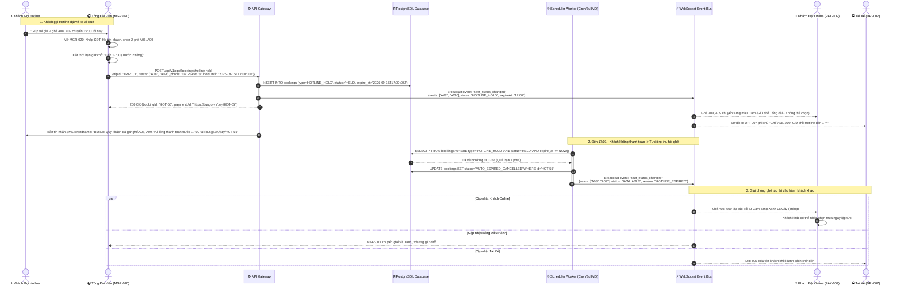

# FLOW-05: Giữ Chỗ Qua Hotline & Tự Động Thu Hồi Ghế (Hotline Seat Hold & Auto-Release)

**Mã tài liệu:** `FLOW-05`  
**Phiên bản:** 1.0  
**Liên kết màn hình:** [MGR-020](file:///home/david/Downloads/scripts/AI_tools/tools/FleetBus/screen-spec/manager/MGR-020-hotline-booking-modal.md), [MGR-013](file:///home/david/Downloads/scripts/AI_tools/tools/FleetBus/screen-spec/manager/MGR-013-seat-inventory-matrix.md), [MGR-017](file:///home/david/Downloads/scripts/AI_tools/tools/FleetBus/screen-spec/manager/MGR-017-booking-management.md), [PAX-009](file:///home/david/Downloads/scripts/AI_tools/tools/FleetBus/screen-spec/passenger/PAX-009-seat-selection.md), [DRI-007](file:///home/david/Downloads/scripts/AI_tools/tools/FleetBus/screen-spec/driver/DRI-007-passenger-manifest-route.md)

---

## 1. Mục Tiêu & Mô Tả Nghiệp Vụ

Một lượng lớn khách hàng quen hoặc người lớn tuổi đặt vé thông qua Tổng đài Hotline của nhà xe (Call Center).
Đặc thù của đặt vé qua điện thoại:
1. **Khách xin giữ chỗ nhưng chưa thanh toán ngay**: Nhà xe cam kết giữ ghế đến trước giờ xe xuất bến 2 tiếng (hoặc theo hạn nộp tiền do tổng đài viên thiết lập: 30 phút, 2 tiếng, 24 tiếng).
2. **Nguy cơ bỏ bom vé (Ghost Booking)**: Nếu khách đổi ý không đi mà không gọi báo hủy, ghế đó sẽ bị khóa lãng phí, khiến khách trên mạng hoặc khách tại quầy không mua được.

Hệ thống cung cấp giải pháp **Giữ Chỗ Hotline Có Thời Gian Sống (Hotline Hold TTL) & Tự Động Thu Hồi**:
- Tổng đài viên thao tác giữ ghế trên modal `MGR-020`, thiết lập thời gian hết hạn (`expireAt`).
- Hệ thống gửi tin nhắn SMS / Zalo ZNS kèm đường link thanh toán trực tuyến VietQR cho hành khách.
- Một Background Scheduler (Cron Worker) chạy định kỳ mỗi 60 giây kiểm tra các đơn hàng hotline quá hạn.
- Nếu quá hạn mà khách chưa thanh toán: Đơn tự động hủy, ghế tự động mở lại trạng thái "Trống" trên toàn hệ thống thời gian thực.

---

## 2. Sơ Đồ Trình Tự Tương Tác (Mermaid Sequence Diagram)

---

## 3. Chính Sách Nghiệp Vụ Chống Lạm Dụng Giữ Chỗ

1. **Giới hạn số ghế / SĐT**: Mỗi số điện thoại gọi hotline chỉ được giữ tối đa 4 ghế cùng lúc nếu chưa có tiền cọc.
2. **Danh sách đen (Blacklist Ghost Callers)**: Nếu một số điện thoại có 3 lần giữ chỗ hotline để tự động hết hạn mà không đi trong vòng 30 ngày, hệ thống sẽ tự động hạ mức ưu tiên và yêu cầu chuyển khoản 100% trước khi cho phép giữ chỗ tiếp theo.
3. **Cảnh báo trước khi hết hạn (Pre-expiry Reminder)**: Trước thời điểm hủy ghế 15 phút, hệ thống tự động bắn 1 thông báo Zalo ZNS / SMS nhắc nhở hành khách thanh toán.
