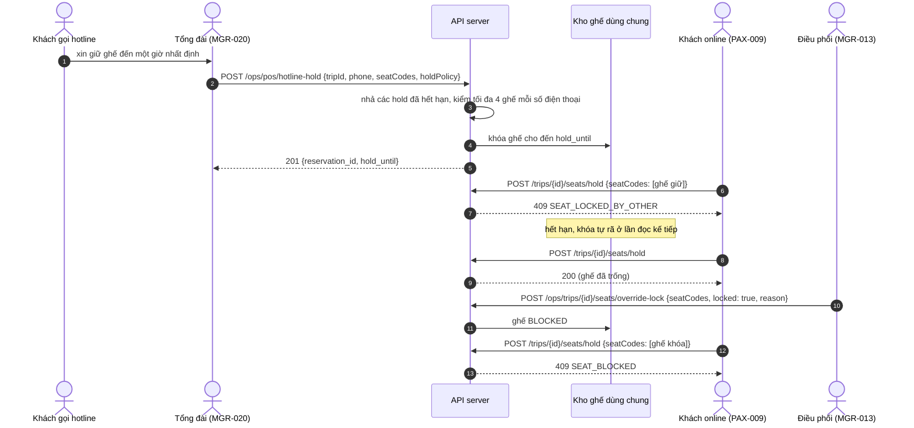

# FLOW-05: Giữ chỗ hotline, khóa ghế kỹ thuật và tự nhả ghế

**Mã tài liệu:** `FLOW-05`
**Phiên bản:** 2.0 (Giai đoạn C)
**Màn hình:** [MGR-020](../manager/MGR-020-pos-seat-map-checkout.md), [MGR-013](../manager/MGR-013-trip-seat-inventory.md), [PAX-009](../passenger/PAX-009-seat-map.md), [DRI-007](../driver/DRI-007-manifest.md)

---

## 1. Mục tiêu

Tổng đài viên giữ ghế cho khách gọi điện đến một hạn nhất định; trong thời gian đó ghế không bán được ở kênh nào khác, và hết hạn thì tự nhả. Điều phối viên cũng có thể khóa ghế hỏng và mở lại. Cả hai đều hiện ở ma trận ghế của điều hành và ở sơ đồ ghế của app.

## 2. Các bước và API thật

| # | Bước | Màn hình | API | Bên khác thấy gì | Test |
| :-- | :--- | :--- | :--- | :--- | :--- |
| 1 | Giữ ghế cho khách gọi: hạn theo `UNTIL_DEPARTURE_OFFSET` (trước giờ chạy n phút) hoặc `CUSTOM_EXPIRY_MINUTES` | MGR-020 | `POST /api/v1/ops/pos/hotline-hold` `{tripId, passengerName, phone, seatCodes, holdPolicy, ...}` | Ma trận ghế hiện `HOTLINE_HOLD` kèm hạn; app hiện `LOCKED_BY_OTHER` | `TC-FLOW-C09`, `TC-SPEC-A46` |
| 2 | Một số điện thoại giữ tối đa 4 ghế cùng lúc, mọi chuyến | MGR-020 | cùng API | Vượt: `400 HOTLINE_LIMIT_EXCEEDED`, không khóa ghế nào (`BR-POS-006`) | `TC-FLOW-C09` |
| 3 | Khách đến quầy lấy vé trước hạn | MGR-020 | `POST /api/v1/ops/pos/orders` `{reservationId, ...}` | Ghế `BOOKED` | `TC-SPEC-A46` |
| 4 | Hết hạn mà khách không đến: ghế tự nhả ở lần đọc hoặc bán kế tiếp | MGR-013, PAX-009 | (không cần worker) | Ghế `AVAILABLE`; số điện thoại đó giữ lại được; khách khác mua được | `TC-FLOW-C09` |
| 5 | Điều phối viên khóa ghế hỏng (bắt buộc ghi lý do) | MGR-013 | `POST /api/v1/ops/trips/{tripId}/seats/override-lock` `{seatCodes, locked: true, reason}` | App hiện `BLOCKED`; giữ, mua ở app, quầy, hotline đều bị `409`; ghế đã bán hoặc đang giữ không khóa được | `TC-FLOW-C03` |
| 6 | Mở khóa | MGR-013 | cùng API, `locked: false` | Ghế `AVAILABLE`; mở ghế không bị khóa: `409 SEAT_NOT_BLOCKED` | `TC-FLOW-C03` |

## 3. Sơ đồ

## 4. Quy tắc

0. Giữ chỗ hotline và bán vé ở quầy cũng theo đoạn đi (`pickupStopId`, `dropoffStopId`, mặc định cả tuyến): một ghế giữ cho đoạn sau vẫn bán được cho đoạn trước (`BR-POS-007`, `TC-SEG-05`).
1. Hotline, quầy, app và tài xế dùng chung kho ghế (`BR-POS-004`, `BR-POS-005`).
2. Hạn giữ chỗ tự rã, không cần bộ lập lịch: mọi lần đọc ma trận, bán vé hay giữ chỗ đều nhả trước (`releaseExpiredHotlineHolds`).
3. Giới hạn 4 ghế mỗi số điện thoại không tính hold đã hết hạn hoặc đã hủy.
4. Mọi lần khóa và mở khóa ghế ghi vào nhật ký kiểm toán (`SEAT_BLOCKED`, `SEAT_UNBLOCKED`).

## 5. Khác với bản cũ

Đã bỏ vì không màn hình nào có và không có kênh gửi tin: danh sách đen khách giữ chỗ rồi bỏ, nhắc 15 phút trước khi hết hạn qua Zalo hoặc SMS, đường dẫn thanh toán `busgo.vn/pay/HOT-55` (`OQ-031`). Đường dẫn cũ `POST /ops/bookings/hotline-hold` đổi thành `POST /ops/pos/hotline-hold`.
