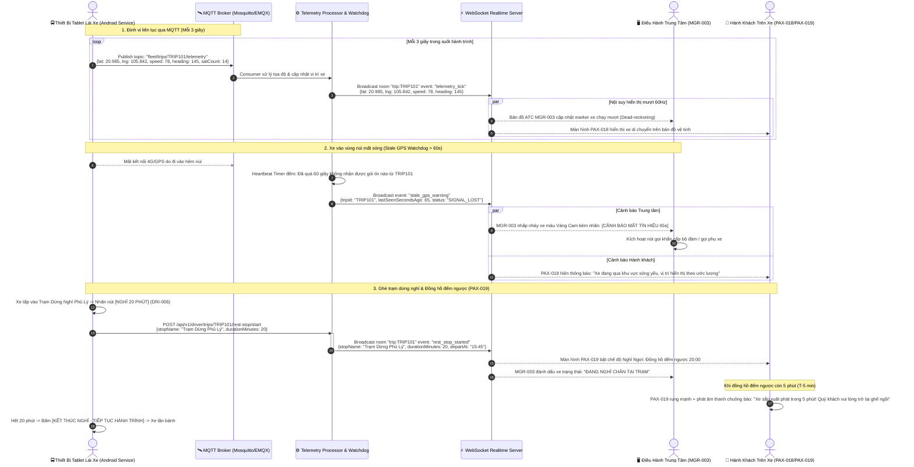

# FLOW-06: Radar GPS Telemetry 60Hz, Cảnh Báo Mất Sóng & Trạm Dừng (Fleet Telemetry & Rest-Stop HUD)

**Mã tài liệu:** `FLOW-06`  
**Phiên bản:** 1.0  
**Liên kết màn hình:** [DRI-006](file:///home/david/Downloads/scripts/AI_tools/tools/FleetBus/screen-spec/driver/DRI-006-driving-hud-route.md), [DRI-014](file:///home/david/Downloads/scripts/AI_tools/tools/FleetBus/screen-spec/driver/DRI-014-gps-hardware-health.md), [PAX-018](file:///home/david/Downloads/scripts/AI_tools/tools/FleetBus/screen-spec/passenger/PAX-018-live-trip-tracking.md), [PAX-019](file:///home/david/Downloads/scripts/AI_tools/tools/FleetBus/screen-spec/passenger/PAX-019-rest-stop-companion.md), [MGR-003](file:///home/david/Downloads/scripts/AI_tools/tools/FleetBus/screen-spec/manager/MGR-003-active-fleet-map.md), [MGR-005](file:///home/david/Downloads/scripts/AI_tools/tools/FleetBus/screen-spec/manager/MGR-005-delay-incident-command.md)

---

## 1. Mục Tiêu & Mô Tả Nghiệp Vụ

Việc giám sát phương tiện theo thời gian thực (Realtime Fleet Telemetry) đóng vai trò trung tâm trong an toàn giao thông và trải nghiệm hành khách:
1. **Radar mượt mà (Smooth 60Hz Rendering)**: Máy tính bảng tài xế bắn tọa độ GPS tần suất $3\text{s}$/lần qua giao thức nhẹ MQTT; tầng Web frontend của Manager và Mobile App của Hành khách sử dụng thuật toán nội suy quán tính (Dead Reckoning Interpolation) để tạo chuyển động xe trôi mượt mà 60 khung hình/giây trên bản đồ.
2. **Cảnh báo mất sóng viễn thông (> 60 giây)**: Khi xe đi qua đèo núi hiểm trở hoặc hầm đường bộ làm mất tín hiệu GPS quá 60 giây, hệ thống tự động kích hoạt trạng thái "MẤT TÍN HIỆU" (Stale GPS Alert), thông báo cho hành khách và kích hoạt giao thức kiểm tra an toàn tại phòng điều hành trung tâm.
3. **Quản lý trạm dừng nghỉ thông minh (Rest Stop Companion HUD)**: Khi xe dừng chân tại trạm dịch vụ (20–30 phút), tài xế kích hoạt đồng hồ đếm ngược. Toàn bộ hành khách nhận được thông báo đồng bộ trên màn hình `PAX-019`, có chuông báo động nhắc lên xe khi còn 5 phút tránh việc khách bị bỏ quên.

---

## 2. Sơ Đồ Trình Tự Tương Tác (Mermaid Sequence Diagram)

---

## 3. Thông Số Kỹ Thuật Viễn Thông (Telemetry SLA)

| Chỉ số | Giá trị chuẩn | Cơ chế bù đắp khi mất mạng |
| :--- | :--- | :--- |
| **Tần suất gửi MQTT** | $3\text{s}$ / lần (Băng thông ~120 bytes/gói) | Bộ đệm cục bộ Tablet lưu tối đa 500 gói tin và gửi dồn burst khi có sóng. |
| **Độ trễ truyền dẫn** | $< 350\text{ms}$ (từ lúc GPS bắt tọa độ tới lúc web manager vẽ lên màn hình) | Sử dụng WebSocket binary packing tối ưu. |
| **Ngưỡng Stale Watchdog** | $60\text{s}$ không nhận gói tin | Cảnh báo mức 1 (Màu Vàng). Sau $15\text{ phút}$ chuyển Cảnh báo mức 2 (Màu Đỏ - Nghi ngờ tai nạn). |
| **Độ chính xác đếm ngược trạm dừng** | Đồng bộ theo thời gian chuẩn Unix NTP Server | Tránh sai lệch giữa đồng hồ điện thoại khách và đồng hồ tablet tài xế. |
