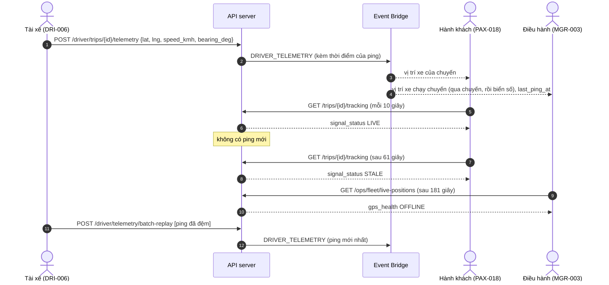

# FLOW-06: Định vị GPS, mất tín hiệu và trạm dừng

**Mã tài liệu:** `FLOW-06`
**Phiên bản:** 2.0 (Giai đoạn C)
**Màn hình:** [DRI-006](../driver/DRI-006-active-trip-dashboard.md), [DRI-014](../driver/DRI-014-gps-health-monitor.md), [DRI-015](../driver/DRI-015-offline-sync-center.md), [PAX-018](../passenger/PAX-018-live-tracking.md), [PAX-019](../passenger/PAX-019-eta-detail.md), [MGR-003](../manager/MGR-003-live-radar.md)

---

## 1. Mục tiêu

Tài xế gửi vị trí xe; hành khách và điều hành cùng thấy xe đó. Khi xe im lặng, cả hai thấy cảnh báo đúng ngưỡng thay vì một vị trí cũ trông như thật.

## 2. Các bước và API thật

| # | Bước | Màn hình | API | Bên khác thấy gì | Test |
| :-- | :--- | :--- | :--- | :--- | :--- |
| 1 | Chuyến phải `IN_TRANSIT`; gửi ping (khoảng 3 giây một lần) | DRI-006 | `POST /api/v1/driver/trips/{tripId}/telemetry` `{lat, lng, speed_kmh, bearing_deg}` | App khách và radar điều hành cùng đọc vị trí đó | `TC-FLOW-C10`, `TC-SYNC-03` |
| 2 | Khách xem xe | PAX-018 | `GET /api/v1/trips/{tripId}/tracking` (hỏi lại mỗi 10 giây) | `signal_status: LIVE` | `TC-FLOW-C10` |
| 3 | Điều hành xem radar | MGR-003 | `GET /api/v1/ops/fleet/live-positions` | Đúng xe đang chạy chuyến đó (tìm qua chuyến, không chỉ biển số), `gps_health: LIVE` | `TC-FLOW-C10` |
| 4 | Im lặng quá 60 giây | PAX-018, MGR-003 | như trên | `STALE` ở cả hai bên | `TC-FLOW-C11` |
| 5 | Im lặng quá 180 giây | PAX-018, MGR-003 | như trên | `OFFLINE` ở cả hai bên | `TC-FLOW-C11` |
| 5b | Xe đứng yên (dưới 1 km/h) quá 5 phút trong bán kính 300 m của một trạm dừng | PAX-018, PAX-019 | như trên | `is_at_rest_stop`, tên trạm và số phút nghỉ dự kiến; chạy lại hoặc ra khỏi vùng thì mất, kẹt xe ngoài trạm không tính | `TC-REST-01`, `TC-REST-02` |
| 6 | Có sóng lại, gửi dồn các ping đã đệm | DRI-015 | `POST /api/v1/driver/telemetry/batch-replay` | Theo thứ tự thời gian, bỏ trùng, giữ vị trí mới nhất; tuổi vị trí tính theo thời điểm của ping | `TC-SPEC-A44`, `TC-SYNC-04` |

## 3. Sơ đồ

## 4. Quy tắc

| Chỉ số | Giá trị | Nguồn |
| :--- | :--- | :--- |
| Tần suất ping | 3 giây (`DRI-006`); bản cũ của flow ghi MQTT, hiện là REST (`OQ-002`) | `BR-COCKPIT-001` |
| `STALE` | quá 60 giây kể từ ping cuối | `BR-TRACK-002`, `BR-RADAR-001` |
| `OFFLINE` | quá 180 giây | `BR-TRACK-002`, `BR-RADAR-001` |
| Trạng thái xe | theo chuyến (`DRI-005`, `DRI-017`), không theo tốc độ: xe dừng ở trạm vẫn là đang chạy | `BR-RADAR-001` |
| Ping chỉ nhận khi | chuyến `IN_TRANSIT`, tọa độ và tốc độ hợp lệ | `BR-COCKPIT-003` |

## 5. Khác với bản cũ

- MQTT broker, WebSocket, nội suy 60Hz, "cảnh báo mức 2 sau 15 phút nghi tai nạn": chưa có; thay bằng REST và hai ngưỡng 60 giây, 180 giây của màn hình.
- Nút "NGHỈ 20 PHÚT" và `POST .../rest-stop/start`: **bỏ**. Không màn hình tài xế nào có nút này. Trạng thái trạm dừng được suy ra tự động từ các ping, đúng `BR-TRACK-004` (`OQ-030`). Danh sách trạm hiện là dữ liệu mẫu trên tuyến Hà Nội đến Thanh Hóa. Đồng hồ đếm ngược và chuông "còn 5 phút" của `PAX-019` là việc của app: server chỉ trả số phút nghỉ dự kiến.
