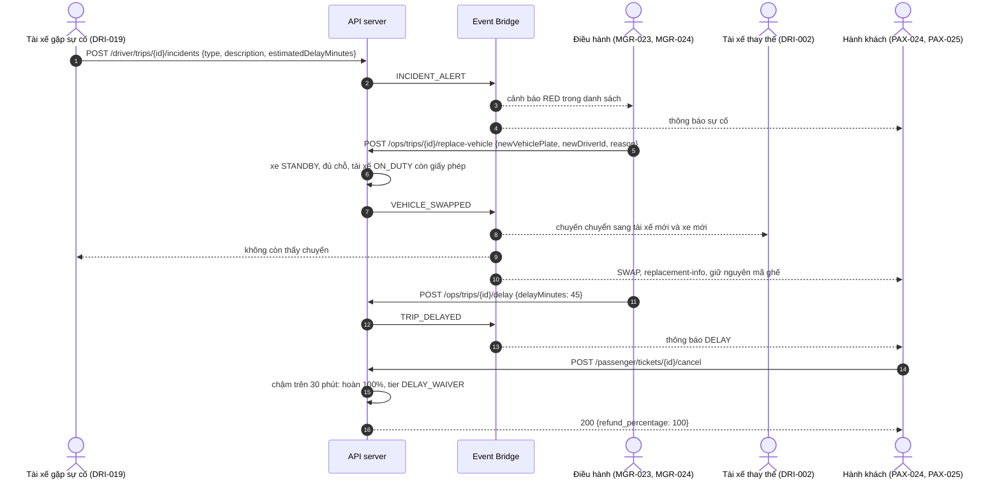

# FLOW-07: Sự cố, đổi xe khẩn cấp và chuyến chậm

**Mã tài liệu:** `FLOW-07`
**Phiên bản:** 2.0 (Giai đoạn C)
**Màn hình:** [DRI-019](../driver/DRI-019-incident-delay-report.md), [MGR-025](../manager/MGR-025-operations-alerts.md), [MGR-023](../manager/MGR-023-vehicle-replacement-wizard.md), [MGR-024](../manager/MGR-024-trip-delay-management.md), [PAX-024](../passenger/PAX-024-vehicle-replacement-notice.md), [PAX-025](../passenger/PAX-025-trip-delay-disruption.md), [PAX-021](../passenger/PAX-021-booking-cancel-refund.md), [DRI-002](../driver/DRI-002-today-trips.md)

---

## 1. Mục tiêu

Tài xế báo sự cố, điều hành đổi sang xe và tài xế khác, hành khách giữ nguyên mã ghế và được thông báo. Khi điều hành công bố chuyến chậm quá 30 phút, hành khách được hủy vé miễn phí.

## 2. Các bước và API thật

| # | Bước | Màn hình | API | Bên khác thấy gì | Test |
| :-- | :--- | :--- | :--- | :--- | :--- |
| 1 | Báo sự cố, ước tính chậm | DRI-019 | `POST /api/v1/driver/trips/{tripId}/incidents` `{type, description, estimatedDelayMinutes}` | Cảnh báo ở danh sách của điều hành (xe hỏng và tai nạn là `RED`); khách đang trên chuyến nhận thông báo; PAX-025 hiện sự cố | `TC-SYNC-05` |
| 2 | Điều hành chọn xe thay thế: phải có thật, đang `STANDBY`, đủ chỗ cho số ghế đã bán | MGR-023 | `POST /api/v1/ops/trips/{tripId}/replace-vehicle` `{newVehiclePlate, newDriverId?, reason}` | Xe cũ vào `MAINTENANCE`, xe mới nhận chuyến | `TC-SPEC-A47`, `TC-FLOW-C12` |
| 3 | Tài xế thay thế phải `ON_DUTY` và còn giấy phép | MGR-023 | cùng API | Không đủ điều kiện: `409 DRIVER_UNAVAILABLE`, không đổi gì | `TC-FLOW-C13` |
| 4 | Chuyến chuyển sang tài xế mới ở cả app tài xế | DRI-002 | `GET /api/v1/driver/trips/today` | Tài xế mới thấy chuyến, tài xế cũ không còn và nhận `403` khi mở chuyến | `TC-FLOW-C12` |
| 5 | Hành khách biết đổi xe, giữ nguyên mã ghế | PAX-024 | `GET /api/v1/trips/{tripId}/replacement-info`, thông báo `SWAP` | `has_replacement: true`, `new_plate_number` | `TC-FLOW-C12`, `TC-SYNC-07` |
| 6 | Điều hành công bố chuyến chậm | MGR-024 | `POST /api/v1/ops/trips/{tripId}/delay` `{delayMinutes, reason}` | Khách nhận thông báo `DELAY`; PAX-025 hiện giờ mới | `TC-FLOW-C14` |
| 7 | Chậm quá 30 phút: khách hủy vé, trong 6 giờ vẫn hoàn 100% | PAX-021 | `POST /api/v1/passenger/tickets/{ticketId}/cancel` | `tier: DELAY_WAIVER`, hoàn 100%, không phí. Chậm 30 phút trở xuống thì không miễn | `TC-FLOW-C14`, `TC-FLOW-C15` |

## 3. Sơ đồ

## 4. Quy tắc

1. Xe thay thế phải có ít nhất bằng số ghế đã bán để mọi hành khách giữ đúng mã ghế (`BR-REPLACE-002`); thiếu thì `409 CAPACITY_INSUFFICIENT` và điều phối viên xử lý phần dư trước (`BR-REPLACE-001`).
2. Chậm chính thức là chậm do điều hành công bố ở `MGR-024`. Ước tính chậm của tài xế ở `DRI-019` không miễn phí hủy (`BR-DELAY-002`).
3. Quyền: đổi xe, hoãn chuyến, khóa ghế dành cho `FLEET_DIRECTOR` và `DISPATCHER` (`MGR-029`).

## 5. Khác với bản cũ

Đã bỏ vì không màn hình nào định nghĩa hay không có dữ liệu để làm (`OQ-031`): voucher giảm 20% tự động khi chậm quá 45 phút (khoản bồi thường mà màn hình định nghĩa là hoàn 100%, `BR-DELAY-001`), thuật toán dồn ghế theo hạng và theo nhóm (xe thay thế bắt buộc đủ ghế, mã ghế giữ nguyên), vé điện tử mới ký lại cho xe mới (vé gắn với chuyến, không gắn với xe), và lệnh điều động gửi đến tablet xe cứu hộ (tài xế thay thế thấy chuyến ở `DRI-002`). Đường dẫn cũ `POST .../swap-vehicle` đổi thành `POST .../replace-vehicle`.
