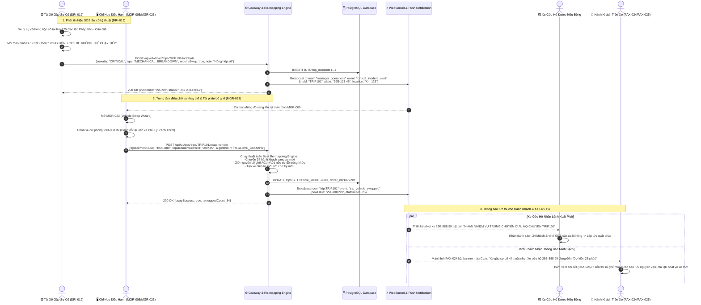

# FLOW-07: Sự Cố Kỹ Thuật, Đổi Xe Khẩn Cấp & Tái Phân Bổ Ghế (Incident & Emergency Swap)

**Mã tài liệu:** `FLOW-07`  
**Phiên bản:** 1.0  
**Liên kết màn hình:** [DRI-019](file:///home/david/Downloads/scripts/AI_tools/tools/FleetBus/screen-spec/driver/DRI-019-incident-report-sos.md), [MGR-005](file:///home/david/Downloads/scripts/AI_tools/tools/FleetBus/screen-spec/manager/MGR-005-delay-incident-command.md), [MGR-023](file:///home/david/Downloads/scripts/AI_tools/tools/FleetBus/screen-spec/manager/MGR-023-vehicle-swap-wizard.md), [PAX-024](file:///home/david/Downloads/scripts/AI_tools/tools/FleetBus/screen-spec/passenger/PAX-024-incident-delay-banner.md), [PAX-025](file:///home/david/Downloads/scripts/AI_tools/tools/FleetBus/screen-spec/passenger/PAX-025-seat-reassignment-modal.md)

---

## 1. Mục Tiêu & Mô Tả Nghiệp Vụ

Trong vận tải đường dài, các sự cố bất khả kháng như hỏng hóc động cơ, nổ lốp, va chạm giao thông hoặc tắc đường nghiêm trọng là những tình huống khẩn cấp đòi hỏi sự phối hợp nhịp nhàng giữa Tài xế, Phòng điều hành trung tâm và Hành khách:
1. **Báo cáo sự cố tức thì (SOS Dispatch < 10 giây)**: Tài xế nhấn nút báo sự cố trên `DRI-019` kèm hình ảnh hiện trường, tọa độ GPS tự động và mức độ nghiêm trọng (Cần cứu hộ / Cần xe thay thế trung chuyển).
2. **Quy trình đổi xe thông minh (Vehicle Swap Wizard)**: Điều hành viên chọn một xe dự phòng gần nhất trên `MGR-023`. Hệ thống tự động chạy thuật toán tái phân bổ ghế (Seat Re-mapping Engine) nhằm giữ nguyên tối đa vị trí tương đương (ghế tầng dưới cho người già/trẻ em, giữ ghế cạnh nhau cho nhóm đi chung).
3. **Đồng bộ hành khách minh bạch (Transparency Push)**: Toàn bộ hành khách nhận được thông báo giải thích lý do, biển số xe cứu hộ mới, số điện thoại tài xế mới và sơ đồ ghế mới đã cập nhật trên `PAX-024` và `PAX-025` để không bị hoang mang.

---

## 2. Sơ Đồ Trình Tự Tương Tác (Mermaid Sequence Diagram)

---

## 3. Thuật Toán Tái Phân Bổ Ghế (Seat Re-mapping Logic)

1. **Nguyên tắc Đồng Hạng (Tier Matching)**:
   - Hành khách ở vé VIP / Giường nằm đơn tầng 1 được ưu tiên xếp vào hạng giường nằm tương đương trên xe thay thế.
2. **Bảo toàn Nhóm Đi Chung (Cluster Preservation)**:
   - Các vé thuộc cùng một `booking_id` phải được xếp cạnh nhau hoặc cùng một khoang giường liền kề.
3. **Chính sách Bồi Thường Tự Động (Auto Compensation Voucher)**:
   - Nếu thời gian trễ do sự cố vượt quá $45\text{ phút}$, hệ thống tự động phát hành một Voucher giảm giá $20\%$ cho chuyến đi tiếp theo gửi thẳng vào ví voucher trên Passenger App của từng người.
