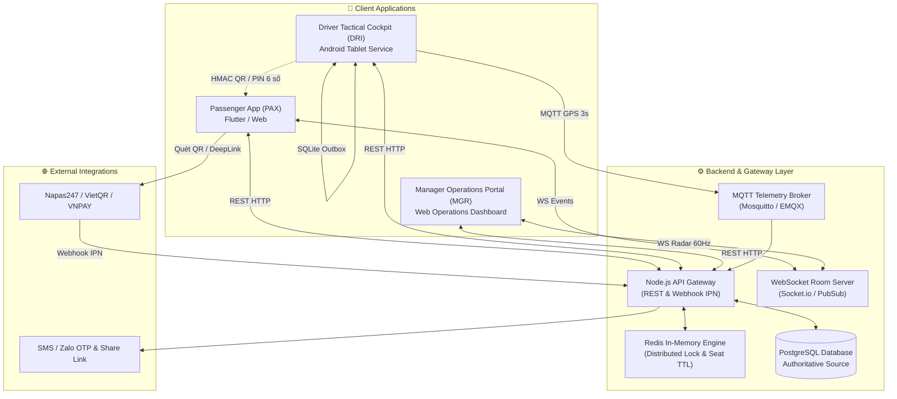

# BusGo Platform — Sơ Đồ Luồng Hoạt Động & Giao Tiếp Đa Ứng Dụng (Cross-App Interaction Flows)

**Document Version:** 1.0  
**Scope:** Toàn bộ hệ thống luồng nghiệp vụ tương tác qua lại giữa 3 ứng dụng chính (Passenger App, Driver Tactical Cockpit, Manager Operations Center) và lớp hạ tầng Backend Gateway / Event Bus.

---

## 1. Danh Mục Các Luồng Nghiệp Vụ (Flow Directory)

| Mã Luồng | Tên Luồng Nghiệp Vụ | Các Ứng Dụng Liên Quan | File Chi Tiết |
| :--- | :--- | :--- | :--- |
| **FLOW-01** | Đặt vé, Giữ chỗ & Thanh toán VietQR tức thì | Passenger App ↔ API Gateway ↔ Ngân hàng ↔ Manager POS | [FLOW-01-booking-vietqr-settlement.md](file:///home/david/Downloads/scripts/AI_tools/tools/FleetBus/screen-spec/flows/FLOW-01-booking-vietqr-settlement.md) |
| **FLOW-02** | Xuất vé QR & Soát vé đa phương thức (Dynamic, Group, PIN) | Passenger App ↔ Driver Cockpit ↔ Local SQLite ↔ Manager ATC | [FLOW-02-boarding-qr-multimodal-checkin.md](file:///home/david/Downloads/scripts/AI_tools/tools/FleetBus/screen-spec/flows/FLOW-02-boarding-qr-multimodal-checkin.md) |
| **FLOW-03** | Thu tiền COD & Biên lai nợ tiền thừa tại trạm dừng | Passenger App ↔ Driver Cockpit ↔ Quầy Thu ngân Trạm nghỉ / Bến | [FLOW-03-cod-cash-debt-settlement.md](file:///home/david/Downloads/scripts/AI_tools/tools/FleetBus/screen-spec/flows/FLOW-03-cod-cash-debt-settlement.md) |
| **FLOW-04** | Đón khách vẫy dọc đường & Khóa ghế thời gian thực | Driver Cockpit ↔ API Gateway ↔ Passenger Seat Map ↔ Manager POS | [FLOW-04-onboard-hail-passengers.md](file:///home/david/Downloads/scripts/AI_tools/tools/FleetBus/screen-spec/flows/FLOW-04-onboard-hail-passengers.md) |
| **FLOW-05** | Giữ chỗ qua Hotline & Tự động thu hồi ghế | Khách gọi Hotline ↔ Manager POS ↔ Scheduler Worker ↔ Khách Online | [FLOW-05-hotline-seat-hold-auto-release.md](file:///home/david/Downloads/scripts/AI_tools/tools/FleetBus/screen-spec/flows/FLOW-05-hotline-seat-hold-auto-release.md) |
| **FLOW-06** | Radar GPS Telemetry 60Hz, Cảnh báo mất sóng & Trạm dừng | Driver GPS Service ↔ MQTT Broker ↔ Passenger Tracking ↔ Manager ATC | [FLOW-06-radar-gps-telemetry-rest-stop.md](file:///home/david/Downloads/scripts/AI_tools/tools/FleetBus/screen-spec/flows/FLOW-06-radar-gps-telemetry-rest-stop.md) |
| **FLOW-07** | Sự cố kỹ thuật, Đổi xe khẩn cấp & Tái phân bổ ghế | Driver Cockpit ↔ Manager Replacement Wizard ↔ Push Service ↔ Khách | [FLOW-07-incident-emergency-vehicle-swap.md](file:///home/david/Downloads/scripts/AI_tools/tools/FleetBus/screen-spec/flows/FLOW-07-incident-emergency-vehicle-swap.md) |

---

## 2. Kiến Trúc Giao Tiếp Đa Tầng (Multi-Protocol Topology)

Hệ sinh thái FleetBus sử dụng mô hình kết hợp (Hybrid Communication Topology):
- **REST APIs (HTTP/2 + JSON)**: Phục vụ các giao dịch trạng thái đơn lẻ (Request/Response) có hỗ trợ `Idempotency-Key`.
- **WebSocket (Realtime Rooms)**: Phát sóng sự kiện tức thì đến từng phiên làm việc của người dùng theo room `trip:{tripId}` hoặc `booking:{bookingId}`.
- **MQTT Telemetry Broker**: Bắn luồng tọa độ GPS tần suất $3\text{s}$/lần từ thiết bị máy tính bảng của tài xế về máy chủ với băng thông tối ưu.
- **Offline Outbox Queue (SQLite)**: Cho phép phụ xe và tài xế soát vé, xác thực mã PIN và thu tiền mặt khi xe đi vào vùng núi hoặc hầm đường bộ không có sóng di động ($0\text{G}/2\text{G}$).

