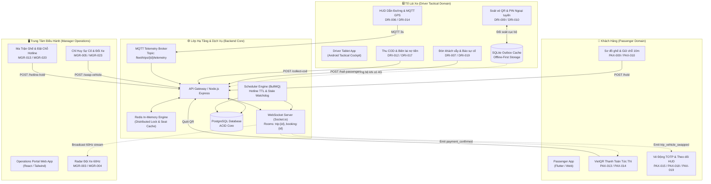
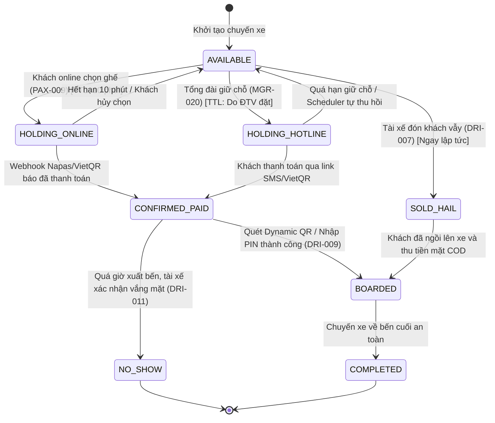

# BusGo Platform — Tài Liệu Toàn Diện Về Sơ Đồ Luồng & Giao Tiếp Đa Ứng Dụng (Cross-App Interaction Flows)

**Tài liệu tham chiếu:** `SPEC-FLOWS-MASTER`  
**Phiên bản:** 1.0  
**Tình trạng:** Authoritative / Đã chuẩn hóa mã nguồn  
**Phạm vi:** Mô tả kiến trúc tích hợp và toàn bộ các luồng giao tiếp thời gian thực giữa 3 ứng dụng khách:
1. **Passenger Mobile & Web App (PAX)**
2. **Driver Tactical Cockpit Android Tablet (DRI)**
3. **Manager Operations & Fleet Dispatch Portal (MGR)**
4. **Lớp Trung Gian: API Gateway, Redis Distributed Lock, MQTT Telemetry Broker & PostgreSQL Database**

---

## 1. Bản Đồ Tổng Quan Các Luồng Nghiệp Vụ (Master Flow Directory)

| Mã Luồng | Tiêu Đề Luồng | Giao Thức Chính | Màn Hình Liên Quan | Tài Liệu Chi Tiết |
| :--- | :--- | :--- | :--- | :--- |
| **FLOW-01** | Đặt vé, Giữ chỗ & Thanh toán VietQR tức thì | REST + Redis Lock + Webhook IPN + WebSocket | PAX-009, PAX-010, PAX-012, PAX-013, PAX-014, MGR-013, MGR-017 | [FLOW-01.md](file:///home/david/Downloads/scripts/AI_tools/tools/FleetBus/screen-spec/flows/FLOW-01-booking-vietqr-settlement.md) |
| **FLOW-02** | Xuất vé QR & Soát vé đa phương thức (Dynamic, Group, PIN, Offline) | TOTP HMAC + SQLite Cache + WebSocket + Outbox Sync | PAX-015, PAX-016, DRI-008, DRI-009, DRI-010, DRI-011, MGR-004 | [FLOW-02.md](file:///home/david/Downloads/scripts/AI_tools/tools/FleetBus/screen-spec/flows/FLOW-02-boarding-qr-multimodal-checkin.md) |
| **FLOW-03** | Thu tiền COD & Biên lai nợ tiền thừa tại trạm dừng | REST + SQLite Sync + QR Voucher + Cash Reconciliation | DRI-012, DRI-017, PAX-012, PAX-015, MGR-017, MGR-028 | [FLOW-03.md](file:///home/david/Downloads/scripts/AI_tools/tools/FleetBus/screen-spec/flows/FLOW-03-cod-cash-debt-settlement.md) |
| **FLOW-04** | Đón khách vẫy dọc đường & Khóa ghế thời gian thực | REST + Redis Mutex + WebSocket Broadcast | DRI-006, DRI-007, PAX-009, MGR-013, MGR-017 | [FLOW-04.md](file:///home/david/Downloads/scripts/AI_tools/tools/FleetBus/screen-spec/flows/FLOW-04-onboard-hail-passengers.md) |
| **FLOW-05** | Giữ chỗ qua Hotline & Tự động thu hồi ghế | REST + Background Cron Scheduler + SMS/ZNS + WebSocket | MGR-020, MGR-013, MGR-017, PAX-009, DRI-007 | [FLOW-05.md](file:///home/david/Downloads/scripts/AI_tools/tools/FleetBus/screen-spec/flows/FLOW-05-hotline-seat-hold-auto-release.md) |
| **FLOW-06** | Radar GPS Telemetry 60Hz, Cảnh báo mất sóng & Trạm dừng | MQTT Telemetry + Dead Reckoning + Stale Watchdog | DRI-006, DRI-014, PAX-018, PAX-019, MGR-003, MGR-005 | [FLOW-06.md](file:///home/david/Downloads/scripts/AI_tools/tools/FleetBus/screen-spec/flows/FLOW-06-radar-gps-telemetry-rest-stop.md) |
| **FLOW-07** | Sự cố kỹ thuật, Đổi xe khẩn cấp & Tái phân bổ ghế | REST + Seat Re-mapping Engine + High-priority Push | DRI-019, MGR-005, MGR-023, PAX-024, PAX-025 | [FLOW-07.md](file:///home/david/Downloads/scripts/AI_tools/tools/FleetBus/screen-spec/flows/FLOW-07-incident-emergency-vehicle-swap.md) |

---

## 2. Kiến Trúc Tương Tác Giữa Các Hệ Thống (Cross-System Interaction Architecture)

> [!TIP]
> **Tùy chọn tải & xem bản vẽ UML:** [Xem ảnh Vector SVG](./images/cross-app-interaction-flows.svg) | [Xem ảnh PNG HD](./images/cross-app-interaction-flows.png)

---

## 3. Ma Trận Ma-sát & Nguyên Tắc Khóa Trạng Thái Ghế (Seat State Interlocking)

> [!TIP]
> **Tùy chọn tải & xem bản vẽ UML:** [Xem ảnh Vector SVG](./images/cross-app-interaction-flows-2.svg) | [Xem ảnh PNG HD](./images/cross-app-interaction-flows-2.png)

Trạng thái của mỗi ghế trên một chuyến xe tuân thủ máy trạng thái nghiêm ngặt (Strict State Machine):

---

## 4. Tổng Hợp Các Điểm Kết Nối Kỹ Thuật (Integration Technical Matrix)

| Kịch Bản | Trigger Điểm Đầu | Giao Thức / Endpoint | Dữ Liệu Trao Đổi | Điểm Đến Nhận Sự Kiện |
| :--- | :--- | :--- | :--- | :--- |
| **Giữ ghế tức thì** | Khách chọn ghế trên PAX-009 | `POST /passenger/bookings/hold` | `{tripId, seatNumbers, passengerId}` | Redis Lock `SETNX` + WS broadcast `seat_status_changed` |
| **Xác nhận tiền về** | Ngân hàng bắn IPN | `POST /webhooks/vietqr-ipn` | `{reference, amount, transId}` | WS emit `payment_confirmed` -> PAX-014 bật màn hình vé |
| **Soát vé ngoại tuyến** | Phụ xe quét QR trong hầm | Local SQLite lookup | `HMAC_SHA256(ticketId, secret, timeWindow)` | Âm thanh Ting! trên DRI-009 + Ghi vào Outbox Sync |
| **Đón khách vẫy** | Phụ xe bấm trên DRI-007 | `POST /driver/trips/:id/hail-passengers` | `{seatNumber, dropoffStop, fare}` | Ghế đổi đỏ trên PAX-009 + Tăng doanh thu chuyến trên MGR-013 |
| **Đổi xe khẩn cấp** | Điều hành chọn trên MGR-023 | `POST /ops/trips/:id/swap-vehicle` | `{replacementBusId, replacementDriverId}` | Vé mới gửi về PAX-025 + Lệnh điều động gửi về DRI-NEW |
