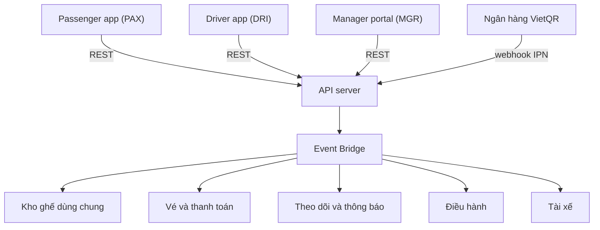
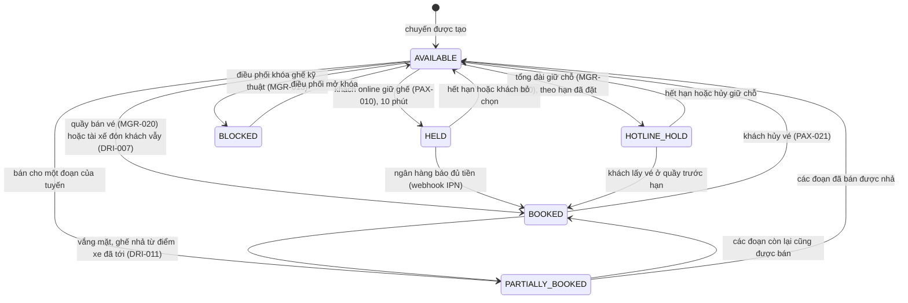

# BusGo Platform: luồng giao tiếp đa ứng dụng (tài liệu tổng)

**Mã tài liệu:** `SPEC-FLOWS-MASTER`
**Phiên bản:** 2.0 (viết lại ở Giai đoạn C, khớp server thật)
**Phạm vi:** ba ứng dụng (Passenger `PAX`, Driver `DRI`, Manager `MGR`) và server dùng chung. Mỗi luồng có file riêng và một test chạy qua HTTP trong `test/flows/flow_conformance.test.js` (`docs/review/phase-C-findings.md`).

---

## 1. Danh mục luồng

| Mã | Luồng | Màn hình | Test |
| :--- | :--- | :--- | :--- |
| `FLOW-01` | [Đặt vé, giữ chỗ, thanh toán VietQR](FLOW-01-booking-vietqr-settlement.md) | PAX-009, 010, 012, 013, 014, 016; MGR-013, 017; DRI-007 | `TC-FLOW-C01`, `C02` |
| `FLOW-02` | [Xuất vé QR, soát vé, vắng mặt](FLOW-02-boarding-qr-multimodal-checkin.md) | PAX-016, 017; DRI-007, 009, 010, 011, 015; MGR-012 | `TC-FLOW-C04`, `C05` |
| `FLOW-03` | [Thu COD, biên lai nợ tiền thừa, chốt chuyến](FLOW-03-cod-cash-debt-settlement.md) | DRI-012, 017; MGR-018, 022, 028 | `TC-FLOW-C06`, `C07` |
| `FLOW-04` | [Đón khách vẫy dọc đường](FLOW-04-onboard-hail-passengers.md) | DRI-007; PAX-009; MGR-013, 017 | `TC-FLOW-C08` |
| `FLOW-05` | [Giữ chỗ hotline, khóa ghế, tự nhả ghế](FLOW-05-hotline-seat-hold-auto-release.md) | MGR-013, 020; PAX-009; DRI-007 | `TC-FLOW-C03`, `C09` |
| `FLOW-06` | [GPS, mất tín hiệu, trạm dừng](FLOW-06-radar-gps-telemetry-rest-stop.md) | DRI-006, 014, 015; PAX-018, 019; MGR-003 | `TC-FLOW-C10`, `C11` |
| `FLOW-07` | [Sự cố, đổi xe, chuyến chậm](FLOW-07-incident-emergency-vehicle-swap.md) | DRI-019, 002; MGR-023, 024, 025; PAX-021, 024, 025 | `TC-FLOW-C12` đến `C16` |

## 2. Kiến trúc: hiện trạng và đích

| | Hiện trạng (có thật, có test) | Đích (chưa có, `OQ-002`) |
| :--- | :--- | :--- |
| Giao thức | REST JSON, Bearer token, `Idempotency-Key` ở các thao tác ghi | thêm WebSocket (`trip:{id}`, `ops:fleet`) và MQTT cho GPS |
| Đẩy sự kiện | Event Bridge trong bộ nhớ nối ba dịch vụ; app **hỏi lại** (PAX-013 mỗi 3 giây, PAX-018 mỗi 10 giây) | đẩy tức thì qua WebSocket |
| Khóa ghế | bảng giữ chỗ có hạn trong bộ nhớ, tự rã khi đọc | Redis `SETNX` với TTL |
| Dữ liệu | bộ nhớ, một tiến trình, dữ liệu mẫu | PostgreSQL |
| Tác vụ nền | không cần: hạn giữ chỗ được xét ở mỗi lần đọc | bộ lập lịch (BullMQ) |

## 3. Máy trạng thái của một ghế

Một kho ghế dùng chung cho app, quầy, hotline và tài xế, tính **theo chặng** giữa hai điểm dừng liên tiếp (`BR-SEAT-001`): một ghế có thể đã bán cho chặng đầu và còn trống cho chặng sau. Sơ đồ dưới là trạng thái tổng của cả ghế trong ma trận của điều hành (`BR-INVENTORY-002`); mỗi chặng có trạng thái riêng `AVAILABLE`, `HELD`, `HOTLINE_HOLD`, `BOOKED`, `BLOCKED`:

Trạng thái của **vé** (ví vé `PAX-016`) đi riêng: `ACTIVE` đến `BOARDED` (quét QR, PIN hoặc tay), `NO_SHOW` (tài xế đánh dấu), `CANCELLED` (khách hủy). Ghế của vé `BOARDED` vẫn tính là đã bán đến hết đoạn của khách; ghế của vé `NO_SHOW` được nhả từ điểm xe đã tới (`OQ-028`). Tab của ví: vé `BOARDED` ở **Sắp đi** đến hết chuyến (`BR-MYTICKETS-004`).

## 4. Điểm nối kỹ thuật

| Kịch bản | Khởi phát | Endpoint thật | Sự kiện nội bộ | Bên nhận |
| :--- | :--- | :--- | :--- | :--- |
| Giữ ghế | Khách chọn ghế | `POST /trips/{id}/seats/hold` | | Ma trận ghế điều hành, sơ đồ ghế app |
| Tiền về | Ngân hàng | `POST /webhooks/vietqr/ipn` | `TICKET_SETTLED` | Manifest tài xế, đơn và doanh thu điều hành, thông báo khách |
| Lên xe | Tài xế quét | `POST /driver/trips/{id}/boarding` | `PASSENGER_BOARDED` | Vé của khách, số khách lên xe |
| Vắng mặt | Tài xế | `POST /driver/trips/{id}/tickets/{id}/no-show` | `PASSENGER_NO_SHOW` | Vé của khách, số vắng mặt, thông báo |
| Thu COD | Tài xế | `POST /driver/trips/{id}/payments/cod-collect` | `COD_COLLECTED` | Đơn `PAID` ở điều hành, ví khách khi `WALLET_CREDIT` |
| Trả nợ tiền thừa | Thu ngân | `POST /ops/debt-receipts/{code}/redeem` | | Nhật ký kiểm toán |
| Khách vẫy | Tài xế | `POST /driver/trips/{id}/onboard-hail` | `HAIL_BOARDED` | Kho ghế, doanh thu điều hành |
| Hotline | Tổng đài | `POST /ops/pos/hotline-hold` | | Ma trận ghế, sơ đồ ghế app |
| Khóa ghế | Điều phối | `POST /ops/trips/{id}/seats/override-lock` | | Sơ đồ ghế app, quầy, hotline |
| Bắt đầu chuyến | Tài xế | `POST /driver/trips/{id}/start` | `TRIP_STARTED` | Chuyến và xe ở điều hành thành `IN_TRANSIT` |
| GPS | Tài xế | `POST /driver/trips/{id}/telemetry` | `DRIVER_TELEMETRY` | Theo dõi của khách, radar điều hành |
| Sự cố | Tài xế | `POST /driver/trips/{id}/incidents` | `INCIDENT_ALERT` | Cảnh báo điều hành, thông báo khách |
| Đổi xe | Điều hành | `POST /ops/trips/{id}/replace-vehicle` | `VEHICLE_SWAPPED` | Tài xế mới và cũ, thông báo khách |
| Hoãn chuyến | Điều hành | `POST /ops/trips/{id}/delay` | `TRIP_DELAYED` | Thông báo khách; hủy vé miễn phí khi chậm quá 30 phút |
| Hủy vé | Khách | `POST /passenger/tickets/{id}/cancel` | `TICKET_CANCELLED` | Ghế nhả, manifest, yêu cầu hoàn tiền ở `MGR-022` |
| Kết thúc chuyến | Tài xế | `POST /driver/trips/{id}/end` | `TRIP_COMPLETED` | Chuyến `COMPLETED`, vé sang tab Lịch sử |

## 5. Quy ước cho mọi luồng

1. Server là nguồn sự thật: app không coi một thao tác là xong trước khi nhận `2xx`.
2. Danh tính lấy từ token, giá do server tính, giờ chạy lấy từ vé (`api-screen-map` mục 6).
3. Mọi thao tác ghi có `Idempotency-Key`; gửi lại cùng khóa trả cùng kết quả.
4. Hình ảnh sơ đồ (`images/`) không còn lưu trong repo vì bản cũ vẽ sai hành vi; các khối Mermaid trong tài liệu hiển thị trực tiếp. Dựng lại ảnh bằng `npm run render:diagrams` khi có `@mermaid-js/mermaid-cli`.
