# FleetBus Server API & Web Manager Tripartite Integration Walkthrough

## Tổng quan kết quả thực hiện (Executive Summary)

Đã hoàn thành phân tích toàn diện, tái cấu trúc và tích hợp thông suốt **3 chiều (Tripartite Real-time Synchronization)** giữa:
1. **Passenger Mobile App** (`source/passenger/` & `source/server/services/passenger/`)
2. **Driver Tactical Cockpit** (`source/driver/` & `source/server/services/driver/`)
3. **Manager Operations Control Center** (`source/manager/` & `source/server/services/manager/`)
4. **Unified Node.js API Gateway & Event Bridge** (`source/server/`)

Mục tiêu cốt lõi: **Đảm bảo mọi nghiệp vụ phát sinh từ bất kỳ nền tảng nào (hành khách đặt vé, tài xế quét QR soát vé, tài xế ping GPS, quản lý quầy bán vé POS, quản lý điều xe khẩn cấp, hành khách hủy vé) đều lập tức phản chiếu tức thời và nhất quán vào trạng thái bộ nhớ và luồng nghiệp vụ của hai nền tảng còn lại.**

---

## 1. Sơ đồ kiến trúc đồng bộ thời gian thực (Architecture Diagram)

```mermaid
graph TD
    subgraph "Passenger App (Android/iOS)"
        PAX_BUY["1. Đặt vé & Thanh toán VietQR"]
        PAX_QR["2. Xuất vé 30s HMAC QR"]
        PAX_RADAR["3. Live Radar HUD xem vị trí xe"]
        PAX_CANCEL["4. Hủy vé & Tính hoàn tiền"]
    end

    subgraph "Unified Server API Gateway & Realtime Bridge"
        BRIDGE["FleetBusEventBridge<br/>(EventEmitter Pub/Sub)"]
        SRV_SEAT["SeatMap Service"]
        SRV_PAY["Payment & Wallet Service"]
        SRV_TRACK["Tracking & Push Notification"]
        SRV_DRV["Driver Ops Service"]
        SRV_MGR["Manager Ops Service"]
    end

    subgraph "Driver Tactical Cockpit (Android/iOS)"
        DRV_MANIFEST["1. Danh sách khách & Thu COD"]
        DRV_SCAN["2. Camera quét vé QR 200ms"]
        DRV_GPS["3. GPS Telemetry 1Hz Stream"]
        DRV_SOS["4. Báo sự cố / Kẹt xe SOS"]
    end

    subgraph "Manager Operations Control Center (Web)"
        MGR_DASH["1. Executive KPIs & Doanh thu"]
        MGR_RADAR["2. Bản đồ giám sát Radar 60Hz"]
        MGR_POS["3. Đặt vé Hotline / Quầy POS"]
        MGR_SWAP["4. Đổi xe thay thế khẩn cấp"]
    end

    %% Event flows
    PAX_BUY -->|POST /checkout & IPN| BRIDGE
    BRIDGE -->|TICKET_SETTLED| DRV_MANIFEST
    BRIDGE -->|TICKET_SETTLED| MGR_DASH
    BRIDGE -->|TICKET_SETTLED| SRV_SEAT

    DRV_SCAN -->|POST /qr-scan| BRIDGE
    BRIDGE -->|PASSENGER_BOARDED| PAX_QR
    BRIDGE -->|PASSENGER_BOARDED| MGR_DASH

    DRV_GPS -->|POST /telemetry| BRIDGE
    BRIDGE -->|DRIVER_TELEMETRY| PAX_RADAR
    BRIDGE -->|DRIVER_TELEMETRY| MGR_RADAR

    DRV_SOS -->|POST /incident| BRIDGE
    BRIDGE -->|INCIDENT_ALERT| MGR_DASH
    BRIDGE -->|INCIDENT_ALERT| PAX_RADAR

    MGR_POS -->|POST /pos/bookings| BRIDGE
    BRIDGE -->|POS_BOOKING_CREATED| SRV_SEAT
    BRIDGE -->|POS_BOOKING_CREATED| DRV_MANIFEST

    MGR_SWAP -->|POST /swap-vehicle| BRIDGE
    BRIDGE -->|VEHICLE_SWAPPED| DRV_MANIFEST
    BRIDGE -->|VEHICLE_SWAPPED| PAX_RADAR

    PAX_CANCEL -->|POST /cancel-refund| BRIDGE
    BRIDGE -->|TICKET_CANCELLED| SRV_SEAT
    BRIDGE -->|TICKET_CANCELLED| DRV_MANIFEST
    BRIDGE -->|TICKET_CANCELLED| MGR_DASH
```



---

## 2. Danh mục 9 luồng sự kiện 3 bên (Tripartite Event Matrix)

| Mã sự kiện | Nguồn phát | Tác động sang Passenger | Tác động sang Driver | Tác động sang Web Manager |
| :--- | :--- | :--- | :--- | :--- |
| `TICKET_SETTLED` | Khách đặt vé & VietQR Webhook | Khóa ghế trên sơ đồ 2D; gửi Push Notification xác nhận vé và lưu vé vào Ví | Tự động thêm hành khách vào danh sách Manifest của chuyến xe | Cập nhật số ghế đã bán, tỷ lệ lấp đầy (Load Factor) và tổng doanh thu |
| `PASSENGER_BOARDED` | Tài xế quét dynamic HMAC QR | Đổi trạng thái vé trong Ví sang `BOARDED`; gửi thông báo chào mừng lên xe | Đổi trạng thái hành khách trên manifest thành `BOARDED` và lưu thời điểm | Tăng chỉ số hành khách đã đón trên bảng điều khiển vận hành |
| `DRIVER_TELEMETRY` | Tài xế truyền GPS 1Hz | Cập nhật vị trí xe trực tiếp, tốc độ, góc quay trên Passenger Live Radar HUD | Hiển thị tốc độ và ETA trên bảng điều khiển buồng lái | Cập nhật tọa độ, tốc độ, trạng thái `IN_TRANSIT` trên Radar Map 60Hz |
| `INCIDENT_ALERT` | Tài xế báo sự cố / delay | Hiển thị cảnh báo Disruption trên Live Radar; gửi push notification trễ chuyến | Ghi nhận trạng thái chuyến có nguy cơ chậm giờ | Đẩy cảnh báo khẩn cấp (Alert `RED`/`AMBER`) lên màn hình điều hành trung tâm |
| `POS_BOOKING_CREATED` | Quầy POS / Hotline Manager | Khóa ghế ngay lập tức trên sơ đồ ghế hành khách | Đưa tên khách và số ghế đặt tại quầy vào manifest xe | Cập nhật doanh thu quầy và chỉ số lấp đầy chuyến |
| `VEHICLE_SWAPPED` | Quản lý điều xe khẩn cấp | Gửi thông báo đổi biển số xe mới; giữ nguyên số ghế đã chọn của hành khách | Cập nhật biển số xe mới được điều động vào chuyến của tài xế | Ghi nhận lịch sử đổi xe khẩn cấp và cập nhật trạng thái đoàn xe |
| `TRIP_DELAYED` | Quản lý phát tin hoãn chuyến | Gửi push notification thông báo số phút hoãn và lý do chi tiết | Cập nhật số phút delay dự kiến trên giao diện buồng lái | Đồng bộ lịch trình chuyến xe trên Dispatch Gantt Board |
| `TICKET_CANCELLED` | Hành khách hủy vé trực tuyến | Tính tiền hoàn theo bậc thời gian; chuyển trạng thái vé sang `CANCELLED` | Đổi trạng thái khách trên manifest xe thành `CANCELLED` | Mở lại ghế trống trên sơ đồ; ghi nhận giao dịch hoàn tiền vào sổ quỹ |
| `TRIP_COMPLETED` | Tài xế bấm kết thúc chuyến | Gửi lời cảm ơn hành khách và đóng màn hình radar trực tiếp | Chốt số liệu chuyến đi, hành khách đã đón, tiền COD đã thu | Chuyển trạng thái chuyến xe sang `COMPLETED`, xe về chế độ `STANDBY` |

---

## 3. Chi tiết nâng cấp kỹ thuật & Khắc phục lỗi (Engineering Fixes)

### A. Thiết kế `FleetBusEventBridge` (`source/server/core/fleetBusEventBridge.js`)
- Kế thừa từ `EventEmitter` của Node.js, cung cấp cơ chế Pub/Sub phi tập trung, độc lập giữa các module.
- Tự động gắn (`bindServices`) vào 5 service cốt lõi: `seatMapService`, `paymentService`, `trackingService`, `driverService`, `managerService`.
- Xử lý mượt mà các trường hợp fallback (ví dụ chuyến xe chưa được nạp sẵn vào bộ nhớ đệm, tự động tìm chuyến theo lộ trình).

### B. Tự sửa lỗi Router HTTP trong `source/server/routes/managerRoutes.js`
- **Nguyên nhân phát hiện**: Khi gọi các endpoint như `/api/v1/ops/trips/:tripId/swap-vehicle` hoặc `/api/v1/ops/trips/:tripId/delay`, logic cắt chuỗi URL `parts[4]` ban đầu lấy nhầm từ khóa `"trips"` thay vì giá trị `:tripId` (nằm ở vị trí index 5).
- **Khắc phục**: Chuyển sang tìm chỉ mục động `parts.indexOf('trips') + 1`, đảm bảo lấy chính xác `tripId` dù tiền tố URL có thay đổi.

### C. Chuẩn hóa cấu trúc bọc dữ liệu (`sendSuccess`)
- Các hàm service nội bộ trả về đối tượng dạng `{ success: true, data: ... }`. Nếu truyền trực tiếp vào `sendSuccess(res, result)` thì payload trả về client sẽ bị bọc 2 tầng (`body.data.data`), làm lệch contract API của mobile/web client.
- **Khắc phục**: Chuẩn hóa toàn bộ router routes (`passengerRoutes.js`, `driverRoutes.js`, `managerRoutes.js`) truyền `result.data || result`.

### D. Chuẩn hóa Dart Syntax & Anti-patterns trên Web Manager
- Loại bỏ hoàn toàn ký tự mũi tên dạng tranh Unicode Dingbat (`\u2794`) trong 5 màn hình Flutter Web Manager (`manager_dashboard_screen.dart`, `manager_dispatch_screen.dart`, `manager_emergency_swap_screen.dart`, `manager_radar_map_screen.dart`, `manager_reports_screen.dart`), thay thế bằng gạch ngang typographic chuẩn (`—`).
- Thêm 2 test kiểm tra tự động (`TC-MGR-WEB-06` và `TC-MGR-WEB-07`) để giám sát liên tục cú pháp Dart (`===`, `async Future`) và đảm bảo 0 picture emojis trong presentation code.

---

## 4. Bằng chứng kiểm thử thực nghiệm (Empirical Validation)

### A. Kết quả kiểm thử tự động toàn diện (`npm test`)
Chạy toàn bộ 15 test suite với **96/96 tests Passed (100% Green)**:

```text
▶ Phase Driver Mobile: Android & iOS Platform Integrity Test Suite (11 tests passed)
▶ Phase Manager Web: Flutter Web Platform & Dashboard Integrity Test Suite (7 tests passed)
▶ Phase Mobile: Android & iOS Platform Integrity Test Suite (11 tests passed)
▶ Phase 1: Core Design System & Utilities Test Suite (7 tests passed)
▶ Phase 2: Authentication & Onboarding Test Suite (4 tests passed)
▶ Phase 3: Discovery, Location Picker & Search Test Suite (5 tests passed)
▶ Phase 4: 2D VIP Seat Map & 10-Minute Seat Hold Test Suite (4 tests passed)
▶ Phase 5: Passenger Manifest & Checkout Review Test Suite (3 tests passed)
▶ Phase 6: Payment, Ticket Wallet & Dynamic HMAC QR Test Suite (4 tests passed)
▶ Phase 7: Live GPS Telemetry, Radar & Disruption Test Suite (4 tests passed)
▶ Phase 8: End-to-End Passenger Server & API Gateway Test Suite (6 tests passed)
▶ Phase Server: Unified Node.js API Gateway Integration Suite (5 tests passed)
▶ Phase Integration: Tripartite Cross-System Synchronization Suite (9 tests passed)
  ✔ TC-SYNC-01: Passenger booking & VietQR IPN settlement automatically updates Driver manifest & Manager revenue
  ✔ TC-SYNC-02: Driver scanning rotating QR marks passenger BOARDED in wallet & updates Manager metrics
  ✔ TC-SYNC-03: Driver GPS telemetry updates Passenger live radar HUD & Manager 60Hz fleet map
  ✔ TC-SYNC-04: Driver batch telemetry replay streams positions to Passenger and Manager
  ✔ TC-SYNC-05: Driver incident SOS alerts Manager Operations & broadcasts push notification to passengers
  ✔ TC-SYNC-06: Manager POS counter booking reserves seat in seat map & adds to Driver manifest
  ✔ TC-SYNC-07: Manager Emergency Vehicle Swap updates Driver plate & notifies Passenger
  ✔ TC-SYNC-08: Passenger ticket cancellation releases seat in seat map & updates Driver manifest
  ✔ TC-SYNC-09: Driver ending trip updates Manager trip status to COMPLETED

ℹ tests 96
ℹ suites 15
ℹ pass 96
ℹ fail 0
```

### B. Kiểm tra tĩnh mã nguồn (`npm run lint`)
```text
> fleetbus-platform@3.0.0 lint
> node --check source/**/*.js test/**/*.test.js
(Clean - 0 errors)
```

### C. Chạy kịch bản liên thông thực tế (`node test/e2e_live_flow.js`)
Toàn bộ hành trình 6 bước được kiểm chứng thành công trong môi trường server trực tiếp:

```text
🚀 Starting FleetBus Live End-to-End Verification against http://localhost:3000

--- 1. SYSTEM HEALTHCHECK ---
✅ Health status: UP | Services: 5

--- 2. PASSENGER BOOKING JOURNEY ---
✅ Handshake Client Version: 3.0.0 | Force Upgrade: false
✅ Found Station: Bến xe Giáp Bát in Hà Nội
✅ Found Trips count: 3 | First Trip: Hà Nội — Thanh Hóa (Cao tốc)
✅ Seat Map retrieved: Total seats = 22 | Decks = 2
✅ 10-Minute Seat Hold Acquired: [ 'A01' ]
✅ Booking Created! PNR: BG-BG3940 | Amount: 180.000 VND | Memo: BUSGO BGBG3940

--- 3. NAPAS247 / VIETQR PAYMENT SETTLEMENT ---
✅ Payment Settled via Webhook! Issued Tickets count: 1

--- 4. PASSENGER TICKET WALLET & DYNAMIC QR ---
✅ Ticket Wallet Active Tickets: 1
✅ Dynamic 30s HMAC QR Payload Generated: BUSGO|BG-BG3940|tkt_BGBG3940_A01|59616935|9799402ad7738d51 | Validity: 30s

--- 5. DRIVER TACTICAL COCKPIT ---
✅ Driver Authenticated: Trần Văn Bình | License: FC
✅ Driver Shift Trips: 2
✅ Pre-start 6-Point Readiness Inspection Passed: READY
✅ Trip Started! Status: IN_TRANSIT
✅ Dynamic HMAC QR Scanned by Driver! Passenger: Nguyễn Văn An | Boarded Seat: A01
✅ Driver Telemetry Streamed: Speed = 65.2 km/h

--- 6. MANAGER OPERATIONS CONTROL CENTER ---
✅ Manager Logged In: Nguyễn Tiến Dũng | Role: FLEET_DIRECTOR
✅ Operations KPIs: Active Fleet = 2 | Load Factor = 87.5 % | Revenue = 840.000 VND
✅ 60Hz Live Fleet Radar Tracked Vehicles: 3
✅ Manager Hotline/POS Ticket Issued! PNR: BG-POS2429 | Passenger: Hoàng Văn Thái
✅ Executive Financial & Punctuality Report: On-time rate = 96.8%

🎉 ALL LIVE APP INTEGRATIONS AND ENDPOINTS VERIFIED SUCCESSFULLY! 100% OPERATIONAL.
```
